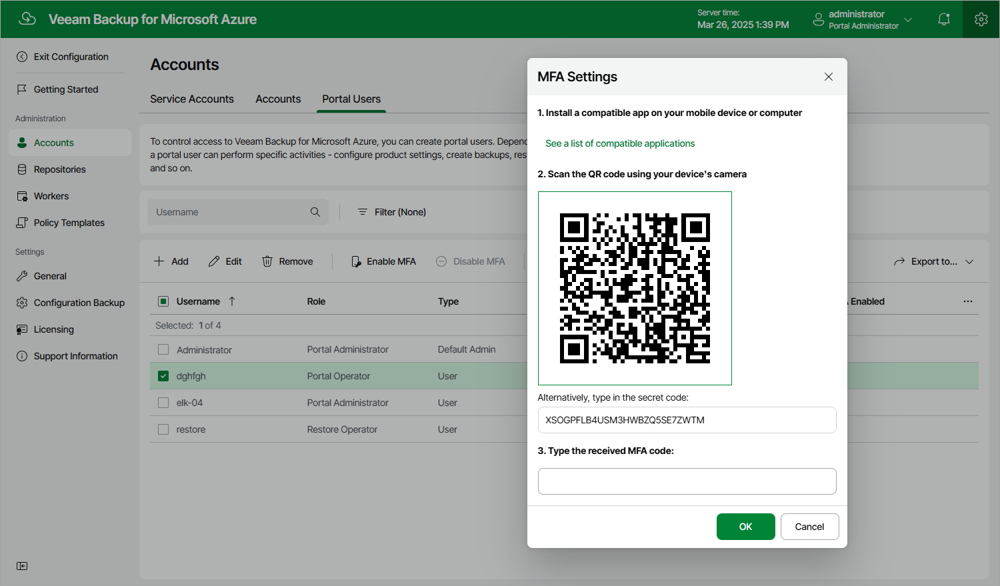

In this article

Multi-factor authentication (MFA) in Veeam Backup for Microsoft Azure is based on the Time-based One-Time Password (TOTP) method that requires the user to verify their identity by providing a temporary six-digit code generated by an authentication application running on a trusted device.

|  |
| --- |
| Important |
| You cannot enable MFA for a user account whose user identity was obtained from an identity provider. |

To enable MFA for a user account, do the following:

1. Switch to the Configuration page.
2. Navigate to Accounts > Portal Users.
3. Select the account and click Enable MFA.
4. Follow the instructions provided in the MFA Settings window:

1. Install a supported authentication application on a trusted device. To view the list of authentication applications supported by Veeam Backup for Microsoft Azure, click See a list of compatible applications.

You can use any application that supports the TOTP protocol.

1. Scan the displayed QR code using the camera of the trusted device.

You can also provide a secret code that you can find in the Alternatively, type in the secret code field if you do not want to scan the QR code.

1. Enter a verification code sent by the authentication application.

1. Click OK.

Page updated 5/30/2025

Page content applies to build 8.0.1.202
