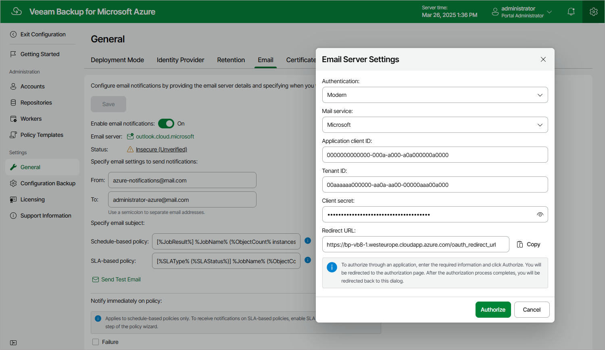

# Configuring Global Notification Settings

You can specify email notification settings for automated delivery of backup policy results and daily reports. Every daily report contains cumulative statistics for all backup policy and snapshot retention sessions run within the past 24-hour period.

To connect an email server that will be used for sending email notifications, do the following:

1. Switch to the Configuration page.
2. Navigate to General > Email.
3. Select the Enable email notifications check box.
4. Click the link in the Email server field and configure [email server settings](#server).

1. In the From field, enter an email address of the notification sender. This email address will be displayed in the From field of notifications.

1. In the To field, enter an email address of a recipient. Use a semicolon to separate multiple recipient addresses.

For each particular policy, you can configure specific notification settings. For more information on backup policies, see [Performing Backup](backup.md).

|  |
| --- |
| Note |
| If you specify the same email recipient in both backup policy notification and global notification settings, Veeam Backup for Microsoft Azure will override the configured global notification settings and will send each notification to this recipient only once to avoid notification duplicates. |

1. In the Subject field, specify a subject for notifications. You can use the following runtime variables:

* %JobName% — a backup policy name.
* %JobResult% — a backup policy result.
* %ObjectCount% — the number of Azure resources in a backup policy.
* %Issues% — the number of Azure resources in a backup policy that encountered any issues (errors and warnings) while being processed.

The default subject for email notifications is: [%JobResult%] %JobName% (%ObjectCount% instances) %Issues%.

1. In the Notify immediately on policy section, choose whether you want to receive email notifications in case backup policies complete successfully, complete with warnings or complete with errors.
2. To receive daily reports, select the Send daily report at check box and specify the exact time when the reports will be sent.
3. Click Save.

|  |
| --- |
| Tip |
| Veeam Backup for Microsoft Azure allows you to send a test message to check whether you have configured all settings correctly. To do that, click Send Test Email. A test message will be sent to the specified email address. |

Configuring Email Server Settings

To configure email server settings, choose whether you want to employ [Basic (SMTP)](#basic) or [Modern (OAuth 2.0)](#modern) authentication for your email server.

Using Basic Authentication

To employ the Basic authentication to connect to your email server, in the Email Server Settings window:

1. From the Authentication drop-down list, select Basic.
2. In the Mail server name or address field, enter a DNS name or an IP address of the SMTP server. All email notifications (including test messages) will be sent by this SMTP server.
3. In the Port field, specify a communication port for SMTP traffic. The default SMTP port is 25.
4. In the Timeout field, specify a connection timeout for responses from the SMTP server.
5. For an SMTP server with SSL/TLS support, select the Connect using SSL check box to enable SSL data encryption.
6. If your SMTP server requires authentication, select the This server requires authentication check box and choose an account that will be used when authenticating against the SMTP server from the Connect as drop-down list. Make sure the account you choose has the permissions to send emails as the notification sender specified in the From field.

For an account to be displayed in the list of available accounts, it must be added to Veeam Backup for Microsoft Azure as described in section [Adding SMTP and Database Accounts](accounts_smtp_database_create.md). If you have not added an account beforehand, click Add and complete the Add Account wizard.

1. Click Save.

Using Modern Authentication

To employ the Modern authentication to connect to your mail service:

1. In Email Server Settings window, copy the URL from the Redirect URL field.
2. For Veeam Backup for Microsoft Azure to be able to use OAuth 2.0 to access Google Cloud or Microsoft Azure APIs, register a new client application either in the [Google Cloud Console](https://developers.google.com/workspace/guides/configure-oauth-consent) or in the [Microsoft Azure portal](https://docs.microsoft.com/en-us/azure/active-directory/develop/quickstart-register-app).

When registering the application, make sure that the redirect URI specified for the application matches the URL copied from the Veeam Backup for Microsoft Azure Web UI.

|  |
| --- |
| Important |
| * If you plan to use a client application registered in the Microsoft Azure portal, you must grant it the Mail.Send Microsoft Graph application permission and the following Microsoft Graph delegated permissions: email, offline\_access, openid, User.Read. For more information on Microsoft Graph permissions, see [Microsoft Docs](https://learn.microsoft.com/en-us/graph/permissions-reference). * If you plan to use a client application registered in a Google Cloud project with a [Testing publishing status](https://support.google.com/cloud/answer/15549945?sjid=9344565301248032133-EU#publishing-status&zippy=%2Ctesting%2Cinternal), keep in mind that authorization will be required every seven days from the time of consent. |

1. Back to the Veeam Backup for Microsoft Azure Web UI, do the following in the Email Server Settings window:

1. From the Authentication drop-down list, select Modern.
2. Use the Mail service drop-down list to choose whether you want to use a Google or Microsoft mail service to send email notifications.
3. In the Application client ID and Client secret fields, provide the Client ID and Client secret created for the application as described in [Google Cloud documentation](https://developers.google.com/workspace/guides/create-credentials#oauth-client-id) or [Microsoft Docs](https://learn.microsoft.com/en-us/azure/active-directory/develop/quickstart-register-app#add-a-client-secret). Make sure the client whose data you provide has the permissions to send emails as the notification sender specified in the From field.
4. [Applies only if you have selected the Microsoft option] In the Tenant ID field, provide the ID of an Microsoft Entra tenant in which the application has been registered.
5. Click Authorize. You will be redirected to the authorization page. Sign in using a Google or Microsoft Azure account to validate the configured settings.

