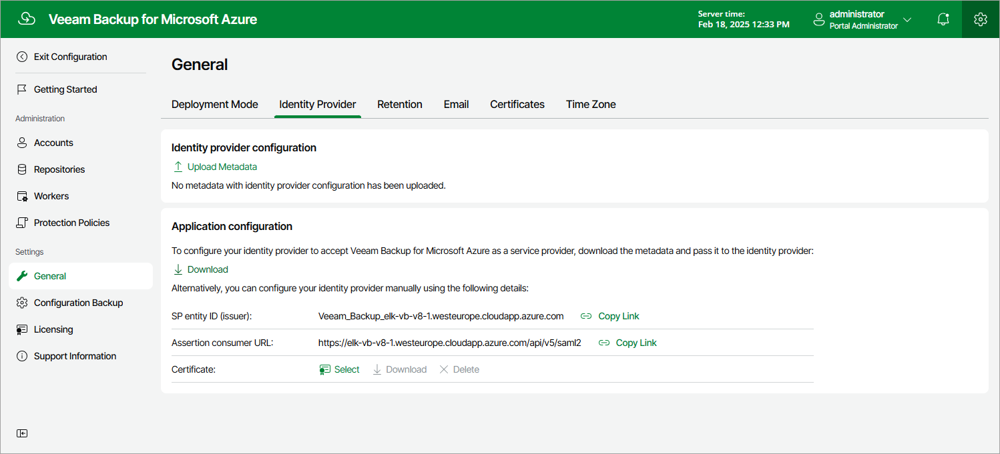
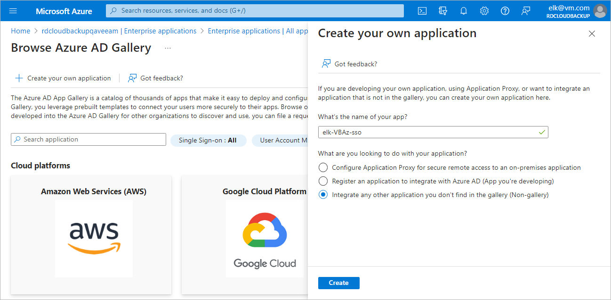
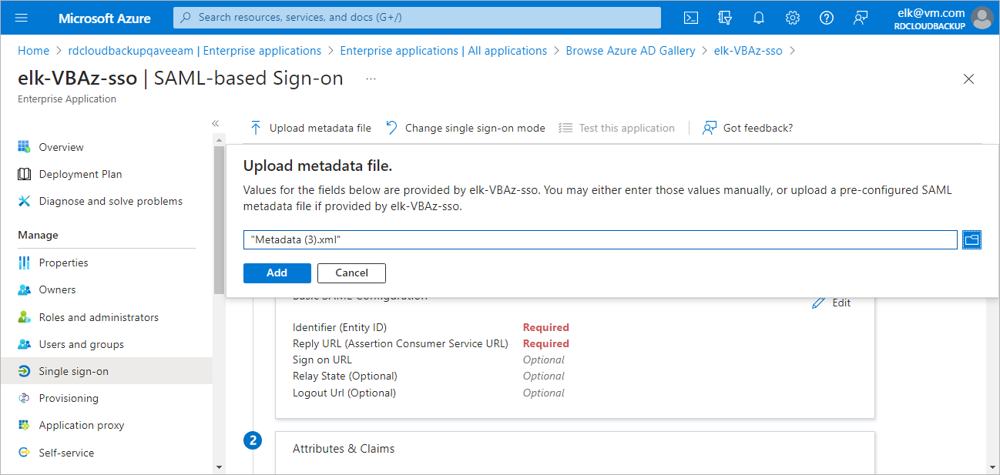
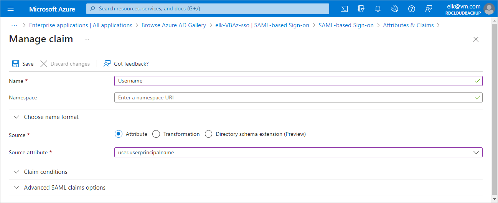
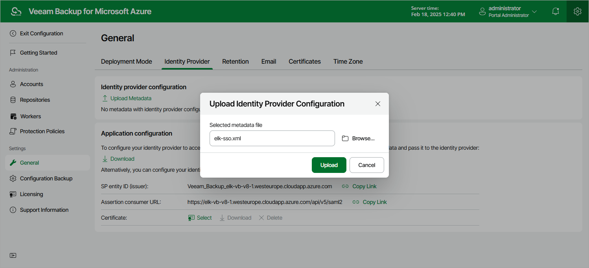
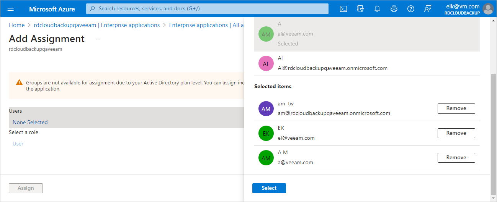

In this article

For Veeam Backup for Microsoft Azure to be able to use Microsoft Entra ID as an identity provider, you must perform the following steps to configure SSO settings:

1. [Obtain the service provider authentication settings on the Veeam Backup for Microsoft Azure side](#sp_settings_obtain).
2. [Configure the SAML single sign-on method for your Microsoft Entra application](#saml).
3. [Forward the service provider authentication settings to your Microsoft Entra application](#sp_settings_forward).
4. [Create a custom claim for your Microsoft Entra application](#claim).
5. [Obtain a file with the identity provider settings](#metadata_obtain).
6. [Import the identity provider settings into the Veeam Backup for Microsoft Azure configuration database](#metadata_import).
7. [[Optional] Add SSO users that will be able to access Veeam Backup for Microsoft Azure](#users_add).

Step 1. Obtain Service Provider Settings

To obtain the service provider authentication settings, do the following:

1. Switch to the Configuration page.

1. Navigate to General > Identity Provider.

1. In the Identity provider configuration section, click Download in the Application configuration section. Veeam Backup for Microsoft Azure will download a metadata file with the service provider authentication settings to your local machine.

Alternatively, you can copy the service provider settings manually:

1. Click Copy Link in the SP entity ID (issuer) field.
2. Click Copy Link in the Assertion consumer URL field.

|  |
| --- |
| Tip |
| If you want to sign and encrypt authentication requests sent from Veeam Backup for Microsoft Azure to the identity provider, select a certificate with a private key that will be used to sign and encrypt the requests:   1. In the Application configuration section, click Select in the Certificate field. 2. In the Upload Security Certificate window, click Browse to locate the certificate file. In the Password field, specify a password used to open the file. 3. Click Upload. |

Step 2. Set up SSO with SAML for Microsoft Entra application

To set up single sign-on with SAML in your Microsoft Entra ID, do the following:

1. Log in to the [Microsoft Azure portal](https://portal.azure.com).
2. Select the Microsoft Entra ID to which the backup appliance belongs.
3. Navigate to Enterprise applications and click New application > Create your own application.
4. In the Create your own application window, specify a name for your Microsoft Entra application and select the Integrate any other application you don't find in the gallery (Non-gallery) option.
5. In the newly created application, navigate to Single sign-on and click SAML.

Step 3. Forward Service Provider Settings to Microsoft Entra ID

To forward the service provider authentication settings to your Microsoft Entra ID, do the following:

1. In the Single sign-on window of your Microsoft Entra application, click Upload metadata file.
2. In the Upload metadata file window, click the folder icon to locate the file with the service provider settings downloaded at [step 1](#sp_settings_obtain).
3. Click Add.
4. In the Basic SAML Configuration window, click Save.

Step 4. Create Claim for Microsoft Entra application

To authenticate a user whose identity is received from the identity provider, Veeam Backup for Microsoft Azure redirects the user to the identity provider portal. After the user logs in to the portal, the identity provider sends a SAML authentication response to Veeam Backup for Microsoft Azure. The SAML response must contain an attribute whose value will be used by Veeam Backup for Microsoft Azure to identify the user. The attribute value must match the user name that you specify when creating the user account.

For the identity provider to send the required attribute in the SAML authentication response, you must create a claim on the identity provider side and specify username as the outgoing claim name:

1. In the Single sign-on window of your Microsoft Entra application, locate the Attributes & Claims section and click Edit.
2. Click Add new claim.
3. In the Manage claim window, specify the following settings:

1. In the Name field, enter Username.
2. In the Choose name format section, select the Attribute option. In the Source attribute field, enter user.userprincipalname.
3. Click Save.

Step 5. Obtain Microsoft Entra ID Metadata

To obtain the Microsoft Entra ID identity provider settings, do the following:

1. In the Single sign-on window of your Microsoft Entra application, locate the Federation Metadata XML field in the SAML Certificates section.
2. Click Download.

Step 6. Import Microsoft Entra ID Metadata

To import the obtained Microsoft Entra ID identity provider settings, do the following:

1. Switch to the Configuration page.
2. Navigate to General > Identity Provider.
3. In the Identity provider configuration section:

1. Click Upload Metadata.
2. In the Upload Identity Provider Configuration window, click Browse to locate the file with the identity provider settings.
3. Click Upload.

[Optional] Step 7. Add SSO Users

To add users that will be able to access Veeam Backup for Microsoft Azure using single sign-on, do the following:

1. In the Single sign-on window of your Microsoft Entra application, navigate to Users and groups.
2. Click Add user/group.
3. In the Add assignment window, click None selected and select users in the Users list.

|  |
| --- |
| Important |
| * Make sure that emails of the selected users match user names of their [user accounts added to Veeam Backup for Microsoft Azure](user_account_add.md). * You can only select users to access Veeam Backup for Microsoft Azure using single sign-on — groups are not supported. |

Page updated 2/18/2025

Page content applies to build 8.0.1.202
