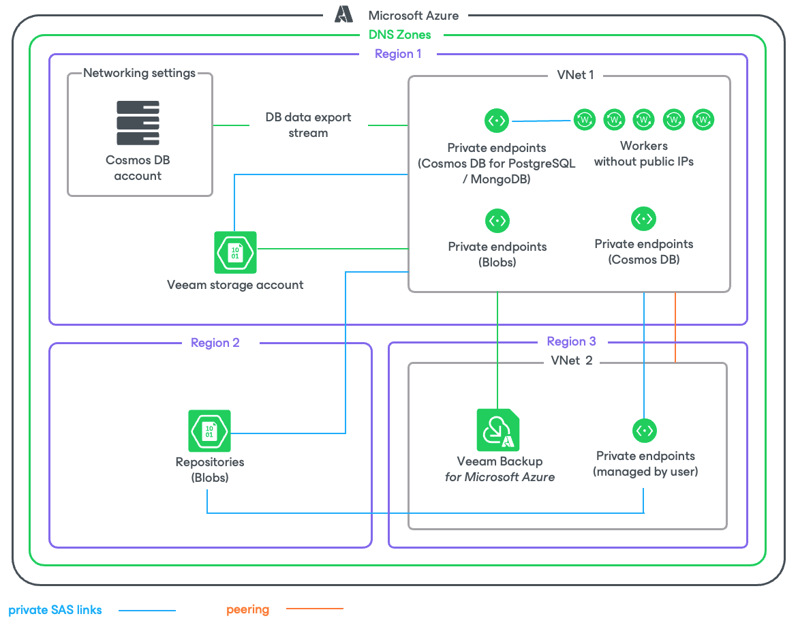

In this article

If the private network deployment functionality is enabled for a backup appliance, Veeam Backup for Microsoft Azure performs Cosmos DB backup in the private environment using continuous backup — a native Microsoft Azure capability that allows you to eliminate consumption of extra provisioned throughput without affecting the database performance and availability. For more information on how continuous backup is performed, see [Microsoft Docs](https://learn.microsoft.com/en-us/azure/cosmos-db/continuous-backup-restore-introduction).

If you enable backup to a repository, Veeam Backup for Microsoft Azure performs Cosmos DB backup in the following way:

1. In the region where the source Cosmos DB for PostgreSQL cluster or the source Cosmos DB for MongoDB account resides, Veeam Backup for Microsoft Azure checks whether there is a virtual network configured for worker instances, and whether there is a storage account assigned the Veeam tag. If there is no such network or storage account in the region, Veeam Backup for Microsoft Azure creates it.

Veeam Backup for Microsoft Azure also checks whether the following private endpoints are configured for the Veeam storage account: one endpoint required for [Azure Blob Storage](https://learn.microsoft.com/en-us/azure/storage/blobs/storage-blobs-overview) and another for [Azure Queue Storage](https://learn.microsoft.com/en-us/azure/storage/queues/storage-queues-introduction). If there are no such endpoints, Veeam Backup for Microsoft Azure creates them in the same resource group, VNet and subnet where the worker instance will be launched at step 2.

1. Veeam Backup for Microsoft Azure launches the worker instance in an Azure region where the processed cluster or account resides in the following way:

1. Uploads worker binary files to the Veeam storage account using a [shared access signature (SAS) URI](https://learn.microsoft.com/en-us/azure/storage/common/storage-sas-overview). Veeam Backup for Microsoft Azure validates every file by checking its MD5 key.
2. Deploys an Azure VM running Ubuntu 22.04 LTS.
3. Sends a [Run Command](https://learn.microsoft.com/en-us/azure/virtual-machines/windows/run-command) to the deployed Azure VM to download the worker binary files from the Veeam storage account using a SAS URI. These files are then used to install software components required for the worker instance to perform backup and restore operations.
4. Creates an Azure Queue in the Azure region where the backup appliance resides. Veeam Backup for Microsoft Azure then uses the Azure Queue Storage messaging service to communicate with the worker instance.

1. If you enable backup to a repository, Veeam Backup for Microsoft Azure creates a backup file of user data contained in the database, transfers the data to the target backup repository and stores it in the native Veeam format.

Page updated 5/13/2025

Page content applies to build 8.0.1.202
