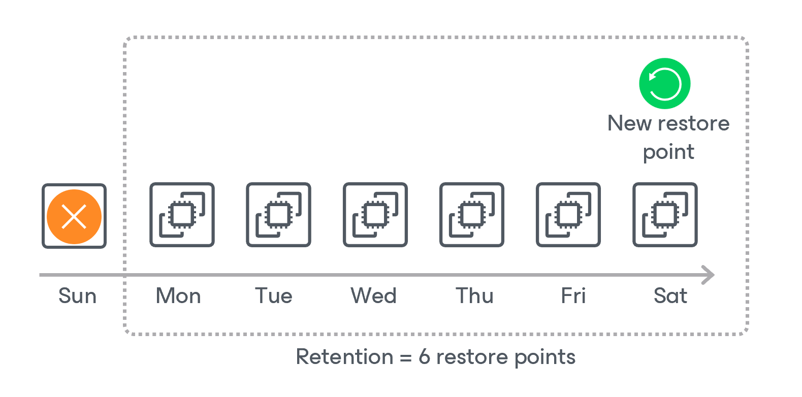

In this article

For protected Cosmos DB accounts, Veeam Backup for Microsoft Azure retains records in the configuration database for the number of days defined in backup target settings as described in section [Creating Cosmos DB Backup Policies](cosmos_db_target_settings.md).

Every 10 minutes, Veeam Backup for Microsoft Azure synchronizes data between Microsoft Azure and the configuration database to create a new database record. If Veeam Backup for Microsoft Azure detects that a record is older than the specified retention period, Veeam Backup for Microsoft Azure removes it from the database. For more information on the retention process, see [Microsoft Docs](https://learn.microsoft.com/en-us/azure/cosmos-db/continuous-backup-restore-introduction).

Every time Veeam Backup for Microsoft Azure synchronizes data between Microsoft Azure and the configuration database, it also checks whether any of the protected Cosmos DB accounts have been removed from Microsoft Azure. If such an account is detected, it will acquire the Deleted status on the [Protected Data page](managing_cosmos_db_data.md) in the Veeam Backup for Microsoft Azure Web UI, and you will still be able to restore this account to any point in time within the specified retention period. After the retention period ends, Veeam Backup for Microsoft Azure will automatically remove all the records created for the account from the configuration database.

|  |
| --- |
| Important |
| When a Cosmos DB for PostgreSQL or a Cosmos DB for MongoDB account is deleted from Microsoft Azure, Veeam Backup for Microsoft Azure instantly removes all the records created for this account from the configuration database and excludes the account from the list of protected resources on the Protected Data page. As a result, you will no longer be able to restore this account — unless you have protected it with the backup to a repository enabled. |

Backup to Repository Retention

If you enable backup to a repository for a backup policy, Veeam Backup for Microsoft Azure retains restore points for the number of days defined in backup scheduling settings as described in section [Creating Cosmos DB Backup Policies](cosmos_db_backup_policy_schedule.md).

The forever forward incremental backup method is not implemented for Cosmos DB for PostgreSQL and Cosmos DB for MongoDB accounts — during every backup session Veeam Backup for Microsoft Azure creates a full backup in the regular backup chain. If Veeam Backup for Microsoft Azure detects an outdated restore point in a standard or an archive backup repository, Veeam Backup for Microsoft Azure removes this restore point from the backup chain.

Page updated 12/9/2025

Page content applies to build 8.0.1.202
