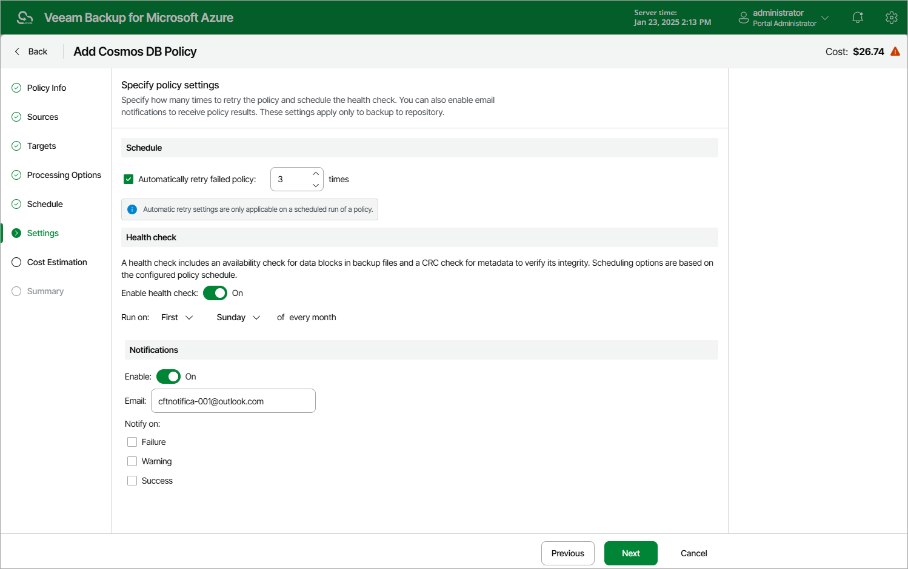

In this article

At the Settings step of the wizard, you can enable automatic retries, schedule health checks and specify notification settings for the backup policy.

Automatic Retry Settings

To instruct Veeam Backup for Microsoft Azure to run the backup policy again if it fails on the first try, do the following:

1. In the Schedule section of the step, select the Automatic retry failed policy check box.
2. In the field to the right of the check box, specify the maximum number of attempts to run the backup policy. The time interval between retries is 600 seconds.

When retrying backup policies, Veeam Backup for Microsoft Azure processes only those Cosmos DB accounts that failed to be backed up during the previous attempt.

|  |
| --- |
| Note |
| The automatic retry settings apply only to backup policies that run according to specific schedules — these settings do not apply to policies [started manually](backup_policy_start_stop.md). |

Health Check Settings

Veeam Backup for Microsoft Azure can periodically perform a health check for all restore points created by the backup policy. During the health check, Veeam Backup for Microsoft Azure performs an availability check for data blocks in the whole regular backup chain, and a cyclic redundancy check (CRC) for metadata to verify its integrity. The health check helps you ensure that the restore points are consistent and that you will be able to restore data using these restore points. For more information on the health check, see [How Health Check Works](cosmos_db_how_health_check_works.md).

|  |
| --- |
| Note |
| During a health check, Veeam Backup for Microsoft Azure does not verify archived restore points created by the policy. |

To instruct Veeam Backup for Microsoft Azure to perform a health check, do the following:

1. In the Health check section of the step, set the Enable health check toggle to On.
2. Use the Run on drop-down lists to schedule a specific day for the health check to run.

|  |
| --- |
| Note |
| Veeam Backup for Microsoft Azure performs the health check during the last policy session that runs on the day when the health check is scheduled. If another backup policy session runs on the same day, Veeam Backup for Microsoft Azure will not perform the health check during that session. For example, if the backup policy is scheduled to run multiple times on Saturday, and the health check is also scheduled to run on Saturday, the health check will only be performed during the last policy session on Saturday. |

Notification Settings

To instruct Veeam Backup for Microsoft Azure to send email notifications for the backup policy, do the following:

1. In the Notifications section of the step, set the Enabled toggle to On.

If you set the toggle to Off, Veeam Backup for Microsoft Azure will not send any notifications for this backup policy — regardless of the configured [global notification settings](configuring_notification_settings.md).

1. In the Email field, specify an email address of a recipient. Use a semicolon to separate multiple recipient addresses.
2. Use the Notify on list to choose whether you want Veeam Backup for Microsoft Azure to send email notifications in case the backup policy completes successfully, completes with warnings or completes with errors.

|  |
| --- |
| Note |
| If you specify the same email recipient in both backup policy notification and [global notification settings](configuring_notification_settings.md), Veeam Backup for Microsoft Azure will override the configured global notification settings and will send each notification to this recipient only once to avoid notification duplicates. |

Page updated 3/19/2025

Page content applies to build 8.0.1.202
