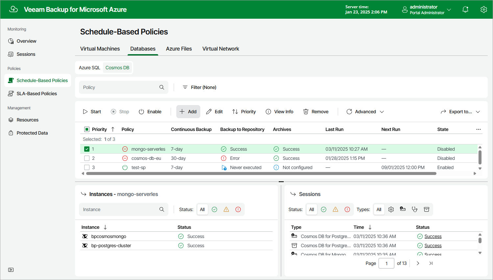

In this article

To launch the Add Cosmos DB Policy wizard, do the following:

1. Navigate to Schedule-Based Policies.
2. Switch to Databases > Cosmos DB.
3. Click Add.

Page updated 3/18/2025

Page content applies to build 8.0.1.202
