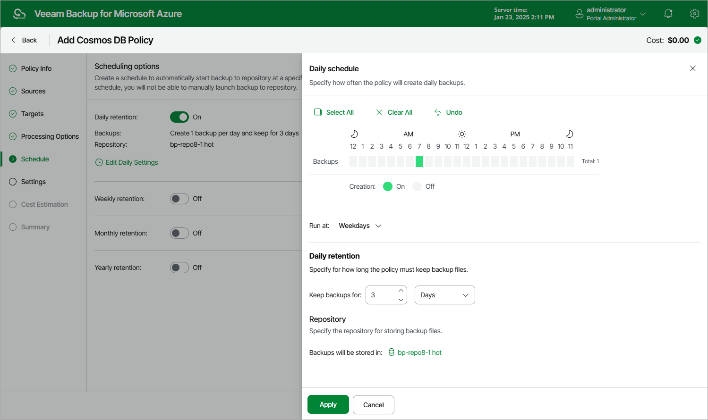
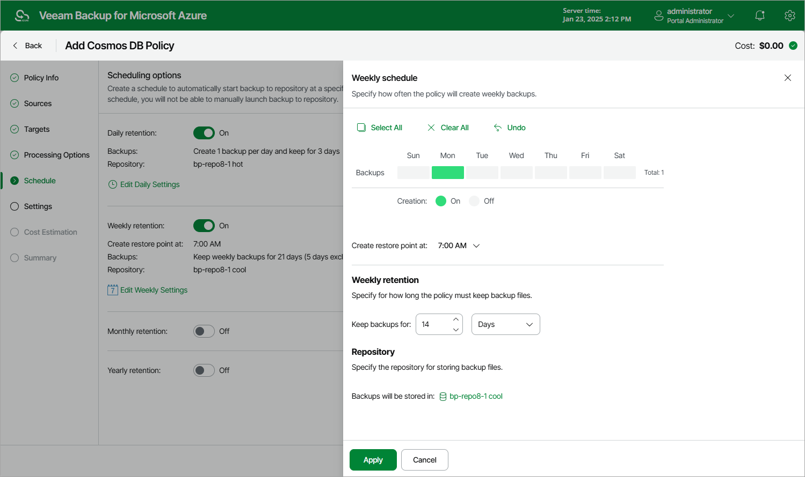
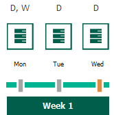
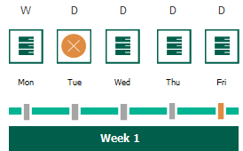
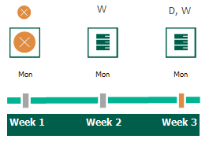

In this article

When you combine multiple types of schedules, Veeam Backup for Microsoft Azure applies the harmonization mechanism that allows you to leverage restore points for long-term retentions instead of taking a new restore point every time. The mechanism simplifies the backup schedule, optimizes the backup performance and reduces the cost of storing restore points in repositories.

With harmonized scheduling, Veeam Backup for Microsoft Azure can keep restore points created according to a daily, weekly or monthly schedule for longer periods of time (for weeks, months and years).

For Veeam Backup for Microsoft Azure to use the harmonization mechanism, there must be specified at least 2 different schedules: one schedule will control the regular creation of restore points, while another schedule will control the process of retaining restore points. In terms of harmonized scheduling, Veeam Backup for Microsoft Azure re-uses restore points created according to a more-frequent schedule (daily, weekly or monthly) to achieve the desired retention for less-frequent schedules (weekly, monthly and yearly). Each restore point is marked with a flag of the related schedule type: the (Daily) flag is used to mark restore points created daily, (Weekly) — weekly, (Monthly) — monthly, and (Yearly) — yearly. Veeam Backup for Microsoft Azure uses these flags to control the retention period for the created restore points. Once a flag of a less-frequent schedule is assigned to a restore point, this restore point can no longer be removed — it is kept for the period defined in the retention settings. When the specified retention period is over, the flag is unassigned from the restore point. If the restore point does not have any other flags assigned, it is removed according to the retention settings of a more-frequent schedule.

Consider the following example. You want a backup policy to create backups of your critical workloads once a day, to keep 3 daily backups in the backup chain, and also to keep one of the created backups for 2 weeks. In this case, you create 2 schedules when configuring the backup policy settings — daily and weekly:

1. In the daily scheduling settings, you select hours and days when backups will be created (for example, 7:00 AM; Weekdays), and specify the number of days for which you want to retain daily restore points in a backup chain (for example, 3).

Veeam Backup for Microsoft Azure will propagate these settings to the schedule with a lower frequency (which is the weekly schedule in our example).

1. In the weekly scheduling settings, you specify which one of the backups created by the daily schedule will be retained for a longer period, and choose for how long you want to keep the selected backup.

For example, if you want to keep the daily restore point created on Monday for 2 weeks, you select 7:00 AM, Monday and specify 14 days in the weekly schedule settings.

According to the specified scheduling settings, Veeam Backup for Microsoft Azure will create image-level backups in the following way:

1. On the first work day (Monday), a backup session will start at 7:00 AM to create the first restore point. The restore point will be marked with the (D) flag as it was created according to the daily schedule.

Since 7:00 AM, Monday is specified in weekly schedule settings, Veeam Backup for Microsoft Azure will assign the (W) flag to this restore point.

1. On the same week, after backup sessions run on Tuesday and Wednesday, the created restore points will be marked with the (D) flag.

1. On the fourth work day (Thursday), after a backup session runs at 7:00 AM, the created restore point will be marked with the (D) flag.

By this moment, the earliest restore point in the backup chain will get older than the specified retention limit. However, Veeam Backup for Microsoft Azure will not remove the earliest restore point (7:00 AM, Monday) with the (D) flag from the backup chain as this restore point is also marked with a flag of a less-frequent schedule. Instead, Veeam Backup for Microsoft Azure will unassign the (D) flag from the restore point. This restore point will be kept for the retention period specified in the weekly scheduling settings (that is, for 2 weeks).

1. On the fifth working day (Friday), after a backup session runs at 7:00 AM, the created restore point will be marked with the (D) flag.

By this moment, the restore point created on Tuesday with the (D) flag will get older than the specified retention limit. Veeam Backup for Microsoft Azure will remove from the backup chain the restore point created at 7:00 AM on Tuesday as no flags of a less-frequent schedule are assigned to this restore point.

1. Veeam Backup for Microsoft Azure will continue creating restore points for the next week in the same way as described in steps 1–4.
2. On week 3, after a backup session runs at 7:00 AM on Monday, the earliest weekly restore point in the backup chain will get older than the specified retention limit. Veeam Backup for Microsoft Azure will unassign the (W) flag from the earliest weekly restore point. Since no other flags are assigned to this restore point, Veeam Backup for Microsoft Azure will remove this restore point from the backup chain.

|  |
| --- |
| Note |
| This section does not explain how Veeam Backup for Microsoft Azure rebuilds the backup chain when applying the configured retention policy settings — it focuses on the harmonization mechanism itself only. To learn what types of backups Veeam Backup for Microsoft Azure includes in the backup chain and how it transforms the chain when removing outdated restore points, see sections [Backup Chain](backup_chain_cosmos_db.md) and [Cosmos DB Backup Retention](cosmos_db_backup_retention.md). |

Page updated 8/20/2025

Page content applies to build 8.0.1.202
