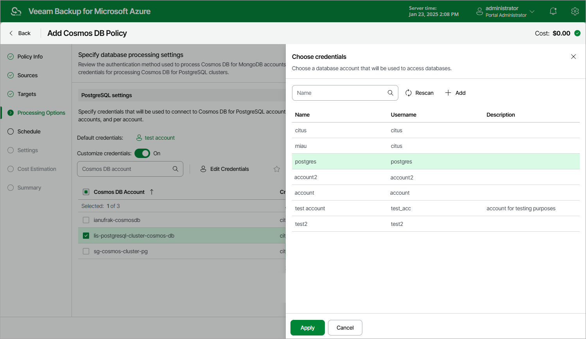

In this article

[This step applies only if you set the Backup to repository toggle to On at the Targets step of the wizard]

At the Processing Options step of the wizard, review the authentication method used to process Cosmos DB for MongoDB accounts and select credentials for processing Cosmos DB for PostgreSQL clusters.

Cosmos DB For MongoDB Account Authentication

To access Cosmos DB for MongoDB accounts and to back up database data, Veeam Backup for Microsoft Azure uses the read-only primary/secondary keys. For more information, see [Microsoft Docs](https://learn.microsoft.com/en-us/previous-versions/azure/cosmos-db/how-to-obtain-keys?tabs=azure-portal).

Cosmos DB For PostgreSQL Account Authentication

In the PostgreSQL settings section, select a database account whose credentials will be used to authenticate against databases of the Cosmos DB for PostgreSQL accounts added to the backup scope. For a database account to be displayed in the list of available accounts, it must be added to Veeam Backup for Microsoft Azure as described in section [Adding SMTP and Database Accounts](accounts_smtp_database_create.md). If you have not added the necessary account to Veeam Backup for Microsoft Azure beforehand, you can do it without closing the Add Cosmos DB Policy wizard. To do that, click Add and complete the Add Account wizard.

By default, the selected database account will be used to access all databases of the Cosmos DB for PostgreSQL accounts added to the backup policy. You can also granularly specify credentials that Veeam Backup for Microsoft Azure will use to connect to specific databases. To do that, set the Customize credentials toggle to On, choose a database for which you want to specify the credentials and click Edit Credentials.

|  |
| --- |
| Important |
| The selected account must have permissions required to perform database dumping operations, and access to all user databases of the processed Cosmos DB accounts — otherwise, the backup operation will fail to complete successfully. |

Page updated 3/19/2025

Page content applies to build 8.0.1.202
