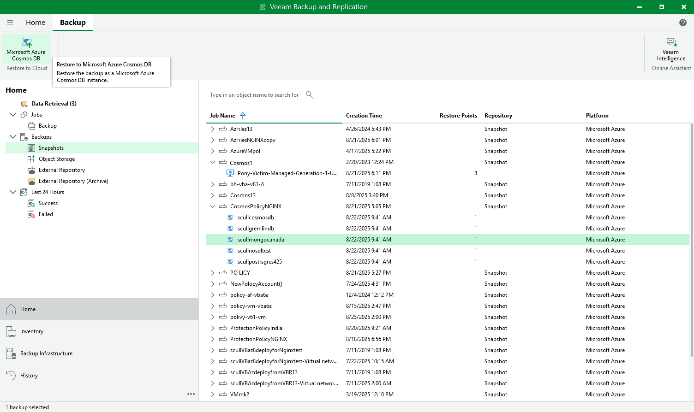
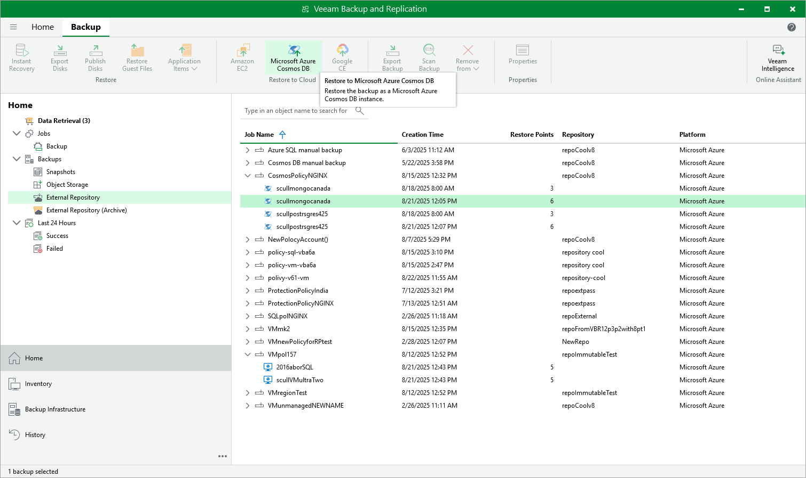

In this article

Veeam Backup & Replication allows you to restore an entire Cosmos DB account or its specific items from a restorable timestamp, or to restore the database of a Cosmos DB for PostgreSQL or a Cosmos DB for MongoDB account from a backup stored in a repository. To learn how Cosmos DB restore works, see [Cosmos DB Restore](cosmos_db_restore_hiw.md).

Point-in-time Restore

To restore a Cosmos DB account from a restorable timestamp, do the following:

1. In the Veeam Backup & Replication console, open the Home view.
2. Navigate to Backups > Snapshots.
3. Expand the backup policy that protects the Cosmos DB account you want to restore, select the account and click Microsoft Azure Cosmos DB on the ribbon.

Alternatively, you can right-click the selected subscription and click Restore to Microsoft Azure Cosmos DB.

Veeam Backup & Replication will open the Cosmos DB Restore wizard in a web browser. Complete the wizard as described in section [Performing Point-in-time Restore](cosmos_db_restore_point_in_time.md).

Restore From Repository

To restore the database of a Cosmos DB for PostgreSQL or a Cosmos DB for MongoDB account from a backup stored in a repository, do the following:

1. In the Veeam Backup & Replication console, open the Home view.

1. Navigate to Backups > External Repository or, to retrieve a backup stored in an archive repository, navigate to Backups > External Repository (Archive).
2. Expand the backup policy that protects the database you want to restore, select the Cosmos DB account managing the database and click Microsoft Azure Cosmos DB on the ribbon.

Alternatively, you can right-click the selected subscription and click Restore to Microsoft Azure Cosmos DB.

Veeam Backup & Replication will open the Cosmos DB Restore wizard in a web browser. Complete the wizard as described in section [Performing Restore From Repository](cosmos_db_restore_from_repository.md).

Page updated 8/25/2025

Page content applies to build 8.0.1.202
