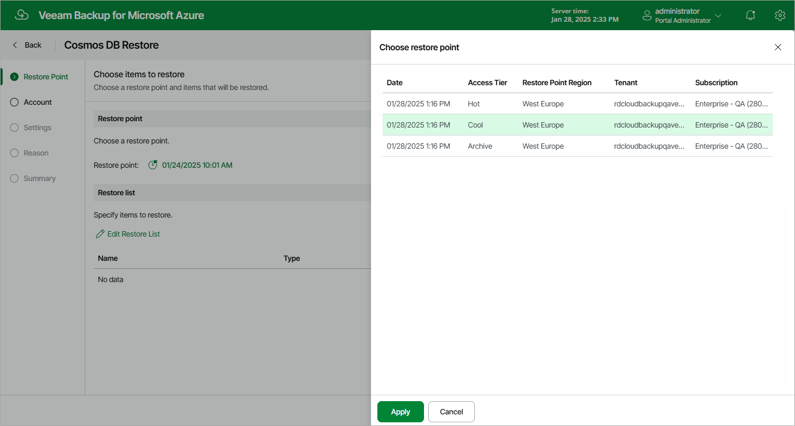
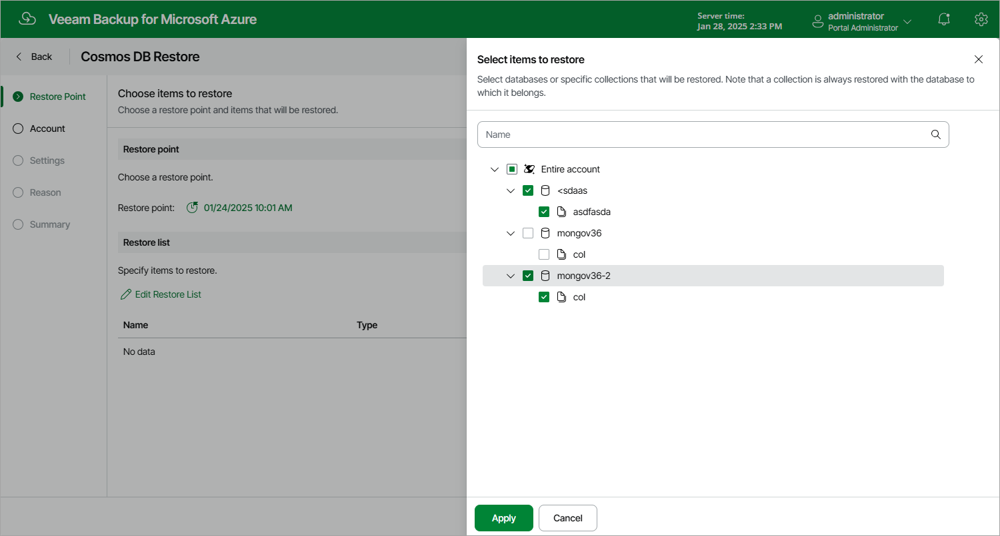

In this article

At the Restore Point step of the wizard, select a restore point that will be used to restore the database of the selected Cosmos DB for PostgreSQL account or databases and collections of a Cosmos DB for MongoDB account. By default, Veeam Backup for Microsoft Azure uses the most recent valid restore point. However, you can restore the database data to an earlier state.

|  |
| --- |
| Important |
| If you select a restore point stored in an archive repository and the same restore point is also available in a regular repository, Veeam Backup for Microsoft Azure will display the confirmation window where you must choose whether you want to use the archived or regular restore point to perform the restore operation. |

To select a restore point, do the following:

1. Click Restore Point.
2. In the Specify restore point window, select the necessary restore point and click Apply.

To help you choose a restore point, Veeam Backup for Microsoft Azure provides the following information on each available restore point:

* Date — the date when the restore point was created.
* Access Tier — the storage tier of a backup repository where the restore point is stored.
* Restore Point Region — an Azure region where the restore point resides.
* Tenant — a Microsoft Entra tenant to which the restore point belongs.
* Subscription — an Azure subscription with which the restore point is associated.

Selecting Items To Restore

[Applies when performing restore for Cosmos DB for MongoDB accounts only]

To restore granular databases and collections of a Cosmos DB for MongoDB account, do the following:

1. In the Restore list section, click Edit Restore List.
2. In the Select items to restore window, select the necessary databases or collections and click Apply.

|  |
| --- |
| Important |
| * If you select a collection, Veeam Backup for Microsoft Azure will restore it together with the database to which this collection belongs. * If the backed-up Cosmos DB for MongoDB account does not contain any databases, the restore operation will fail. |

Page updated 4/29/2025

Page content applies to build 8.0.1.202
