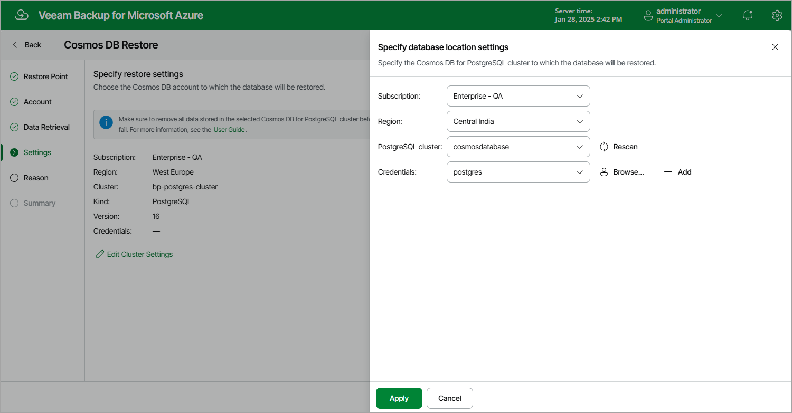
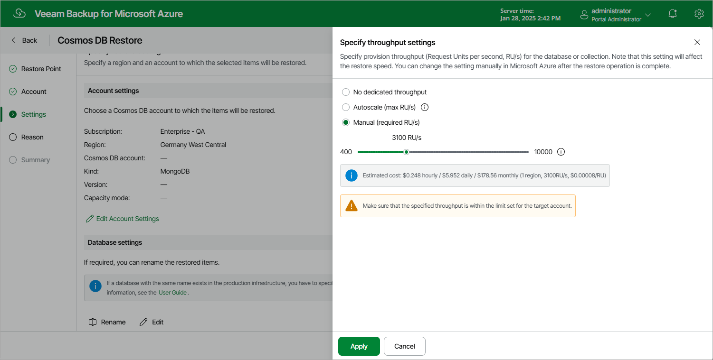

In this article

At the Settings step of the wizard, choose whether you want to restore the database to the original or to a custom location, and specify a region and an account to which the selected items will be restored.

Configuring Cosmos DB For PostgreSQL Account Restore Settings

To choose the location to which the database of a Cosmos DB for PostgreSQL account will be restored, click Edit Cluster Settings, and then select an Azure subscription, an Azure region and a Cosmos DB for PostgreSQL cluster to which the database will be restored.

|  |
| --- |
| Important |
| When selecting a Cosmos DB for PostgreSQL cluster, make sure that the selected cluster does not contain any data and has sufficient storage capacity to accommodate the restored database. Otherwise, Veeam Backup for Microsoft Azure will fail to perform the restore operation. |

You must also specify a database account that will be used to restore database data to the selected location. It is recommended that you select an account that has the built-in citus role.

For a database account to be displayed in the Credentials list, it must be added to Veeam Backup for Microsoft Azure as described in section [Adding SMTP and Database Accounts](accounts_smtp_database_create.md). If you have not added the necessary account to Veeam Backup for Microsoft Azure beforehand, you can do it without closing the Cosmos DB Restore wizard. To do that, click Add and complete the [Add Account wizard](accounts_smtp_database_create.md).

Configuring Cosmos DB For MongoDB Account Restore Settings

To choose the location to which the selected databases and collections of a Cosmos DB for MongoDB account will be restored, click Edit Account Settings, and then select an Azure subscription, an Azure region and a Cosmos DB for MongoDB account to which the databases and collections will be restored. If you want to specify a new name for a restored database or collection, select the necessary item in the Database settings section, click Rename and provide a new name for the item. Consider that Veeam Backup for Microsoft Azure uses the read-write primary/secondary keys to restore database and collection data to the selected location. For more information, see [Microsoft Docs](https://learn.microsoft.com/en-us/previous-versions/azure/cosmos-db/how-to-obtain-keys?tabs=azure-portal).

|  |
| --- |
| Important |
| When selecting a Cosmos DB for MongoDB account, make sure that the MongoDB version of this account is not earlier than the MongoDB version of the Cosmos DB for MongoDB account that originally managed the databases and collections. |

You can restore the selected databases and collections to a Cosmos DB for MongoDB account created in either of the following capacity modes: serverless throughput or provisioned throughput. A capacity mode is a native Microsoft Azure capability that allows you to manage costs of all database operations based on throughput (Request Units per second, RU/s). The serverless throughput capacity mode implies that a Cosmos DB for MongoDB account is billed for consumed RU/s only, while the provisioned throughput capacity mode allows you to set a dynamic or specific maximum number of RU/s. For more information on capacity modes, see [Microsoft Docs](https://learn.microsoft.com/en-us/azure/cosmos-db/request-units).

When restoring databases and collections to a Cosmos DB for MongoDB account created in the provisioned throughput capacity mode, Veeam Backup for Microsoft Azure automatically re-uses the originally configured throughput settings (if any); however, you can change these settings, if necessary. If the restored databases and collections were originally managed by a Cosmos DB for MongoDB account created in the serverless throughput capacity mode, you must configure throughput settings manually.

|  |
| --- |
| Important |
| When configuring throughput settings, you must specify these settings for at least one granularity level (either for a database or for each of its collections). For more information, see [Microsoft Docs](https://learn.microsoft.com/en-us/azure/cosmos-db/set-throughput). |

To specify throughput settings for a database or collection, do the following:

1. In the Database settings section, choose an item for which you want to specify the throughput and click Edit.
2. In the Specify throughput settings window, choose either of the following options:

* No dedicated throughput — if you select this option for a collection, the collection will share the throughput specified for the database to which this collection belongs; if you select this option for a database, you must specify throughput settings individually for each collection that belongs to this database.

Note that one database can share the throughput among a maximum of 25 collections. That is why you can select the No dedicated throughput option for a maximum of 25 collections of the same database. For more information, see [Microsoft Docs](https://learn.microsoft.com/en-us/azure/cosmos-db/set-throughput#set-throughput-on-a-database).

* Autoscale — if you select this option, Microsoft Azure will automatically scale the throughput depending on the usage, within the range limited by the maximum number of RU/s you set on the slider.
* Manual — if you select this option, Microsoft Azure will assign the exact throughput based on the number of RU/s that you set on the slider.

|  |
| --- |
| Notes |
| If you select the Autoscale or Manual option, make sure that the number of RU/s you set on the slider is within the limit set for the target account in Microsoft Azure. The slider is limited by 10000 RU/s — to be able to select a greater number, you can perform the restore operation by sending the HTTP POST request to the /api/v8/restorePoints/cosmosDb/repository/{restorePointId}/restore endpoint as described in the Veeam Backup for Microsoft Azure REST API Reference, section [Cosmos DB Restore Points](https://helpcenter.veeam.com/references/vbazure/8.1/rest/main/tag/CosmosDbRestorePoint#operation/CosmosDbRestorePoint_RestoreCosmosDbAccount). |

Page updated 9/1/2025

Page content applies to build 8.0.1.202
