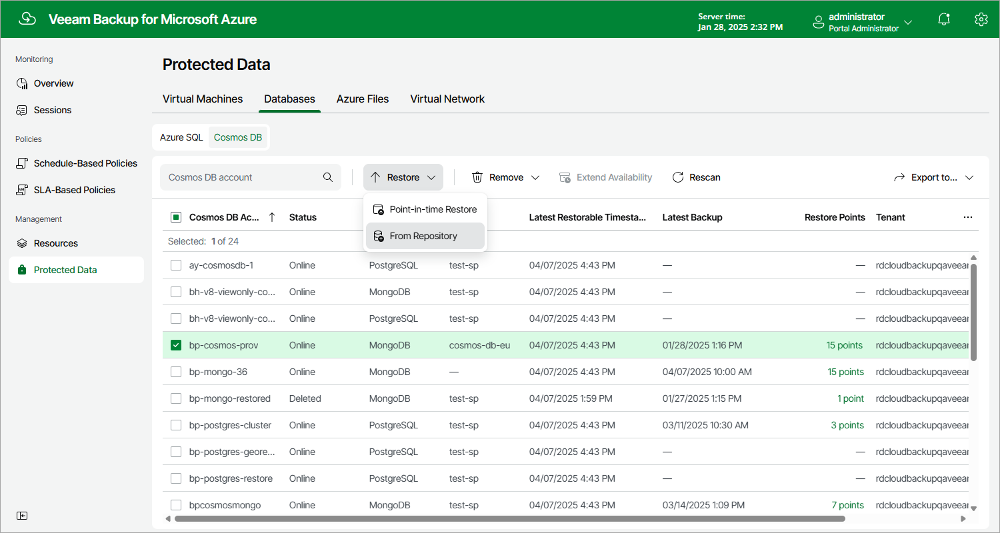

In this article

To launch the Cosmos DB Restore wizard, do the following:

1. Navigate to Protected Data > Databases > Cosmos DB.
2. Select the Cosmos DB account that you want to restore.
3. Click Restore > From Repository.

Alternatively, click the link in the Restore Points column. Then, in the Available Restore Points window, select the necessary restore point and click Restore.

Page updated 3/17/2025

Page content applies to build 8.0.1.202
