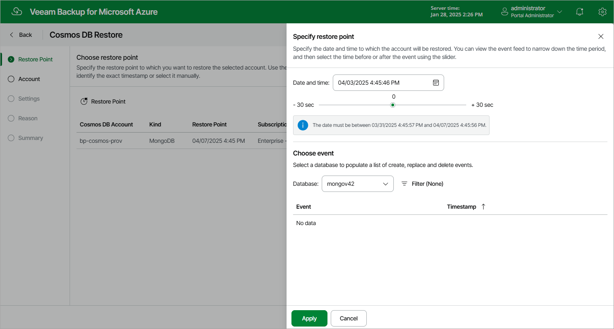

In this article

At the Restore Point step of the wizard, select a timestamp that will be used to restore the selected Cosmos DB account. By default, Veeam Backup for Microsoft Azure uses the most recent valid timestamp. However, you can restore the account data to an earlier state.

To select a timestamp, do the following:

1. Click Restore Point.
2. In the Specify restore point window, use either of the following options:

* Specify the timestamp manually. To do that, click the calendar icon next to the Date and time field, choose the timestamp within the available restore window, and click Apply.
* Choose a specific event to identify the necessary timestamp. To do that, select a database whose event you want to use, choose the event from the list of available events, and click Apply.

To adjust the timestamp, you can use the slider below the Date and time field.

|  |
| --- |
| Notes |
| * You can only choose an event when restoring Cosmos DB accounts created using the NoSQL, MongoDB RU-based, Apache Gremlin and Table APIs. * If you want to select a timestamp that is close to the beginning of the restore window, keep in mind that this timestamp may become outdated while you are completing the Cosmos DB Restore wizard, which may result in the restore operation failure. That is why it is recommended that you plan the time that you will need to configure the restore settings and choose timestamps accordingly — typically, it takes about 5 minutes to complete the wizard. |

Page updated 7/16/2024

Page content applies to build 8.0.1.202
