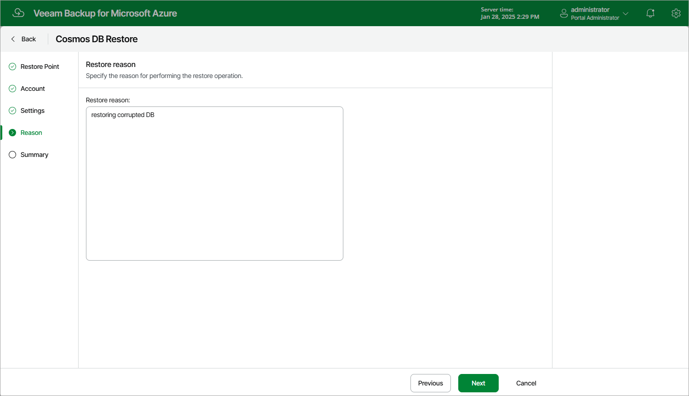

In this article

At the Reason step of the wizard, specify a reason for restoring the Cosmos DB account. This information will be saved to the session history, and you will be able to reference it later.

Page updated 6/19/2024

Page content applies to build 8.0.1.202
