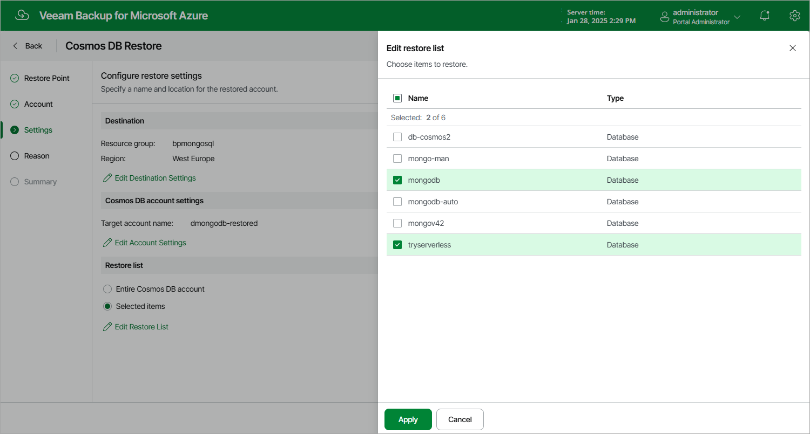

# Step 4. Configure Restore Settings

At the Settings step of the wizard, do the followng:

1. In the Destination section, click Edit Destination Settings to select a resource group and an Azure region to which the account will be restored.
2. In the Cosmos DB account settings section, click Edit Account Settings to specify a new name for the restored account.
3. [Applies only to Cosmos DB accounts created using the NoSQL, MongoDB RU-based, Apache Gremlin and Table APIs] In the Restore list section, choose whether you want to restore the entire Cosmos DB account or its specific items only. If you select the Selected items option, you must also specify the items explicitly — to do that, click Edit Restore List.

|  |
| --- |
| Notes |
| * You can choose a resource group only when restoring a Cosmos DB account created using the NoSQL, MongoDB RU-based, Apache Gremlin or Table API. However, you will be able to restore this account only to the region where the source Cosmos DB account or its replica resided. * When restoring a Cosmos DB for PostgreSQL account, you can choose a region only if the account has the geo-redundant backup capability enabled. However, due to Microsoft Azure limitations, you will be able to restore this account to its primary region only. Consider that the restored account will have the capability disabled, and you will not be able to change this setting for the account. For more information, see [Microsoft Docs](https://azure.microsoft.com/en-us/updates/general-availability-azure-cosmos-db-for-postgresql-georedundant-backup-and-restore/#:~:text=Geo%2Dredundant%20backup%20for%20Azure,be%20enabled%20during%20cluster%20provisioning.). |

