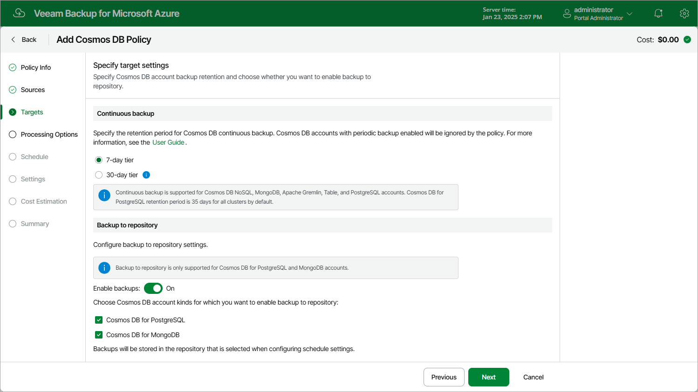

# Step 4. Configure Backup Target Settings

By default, Veeam Backup for Microsoft Azure protects Cosmos DB accounts using [continuous backup](https://learn.microsoft.com/en-us/azure/cosmos-db/continuous-backup-restore-introduction) — a native Microsoft Azure capability that allows you to eliminate consumption of extra provisioned throughput without affecting the database performance and availability. The backups are created in Azure regions in which source Cosmos DB accounts reside and are kept for a specific retention period. At the Targets step of the wizard, you can configure that period and also choose to store backups of Cosmos DB for PostgreSQL or Cosmos DB for MongoDB accounts in a repository.

|  |
| --- |
| Important |
| Consider the following:   * Veeam Backup for Microsoft Azure does not support protecting Cosmos DB accounts that have [periodic backup](https://learn.microsoft.com/en-us/azure/cosmos-db/periodic-backup-restore-introduction) or [multi-region writes](https://learn.microsoft.com/en-us/azure/cosmos-db/how-to-manage-database-account#configure-multiple-write-regions) enabled. If such an account is included in the backup scope, Veeam Backup for Microsoft Azure will not process it. If you want Veeam Backup for Microsoft Azure to protect this account, provision the account with continuous backup and point-in-time restore in Microsoft Azure as described in [Microsoft Docs](https://learn.microsoft.com/en-us/azure/cosmos-db/provision-account-continuous-backup). * Storing backups in a repository is supported for Cosmos DB for PostgreSQL accounts and Cosmos DB for MongoDB accounts of MongoDB versions 3.6 and later. |

The default retention period for continuous backup is 7 days. To change the retention period, select the 30-day tier option in the Continuous backup section. Note that changing the retention period will cause additional infrastructure charges. For more information on Cosmos DB pricing, see [Microsoft Docs](https://azure.microsoft.com/en-us/pricing/details/cosmos-db/autoscale-provisioned/).

|  |
| --- |
| Note |
| Regardless of the specified retention period for continuous backup, backups of Cosmos DB for PostgreSQL accounts are kept for 35 days. |

As soon as you start the backup policy, Veeam Backup for Microsoft Azure will run a configuration session to check the continuous backup retention period defined in Microsoft Azure for all the Cosmos DB accounts added to the backup scope; if the retention period differs from the retention period specified in the backup policy settings, Veeam Backup for Microsoft Azure will redefine the retention period in Microsoft Azure. To track the progress of the configuration session, navigate to the [Session Log page](session_statistics.md#session_log).

|  |
| --- |
| Tip |
| Veeam Backup for Microsoft Azure will keep running configuration sessions every 8 hours. If you want to adjust the frequency, open a [support case](support_information.md). |

