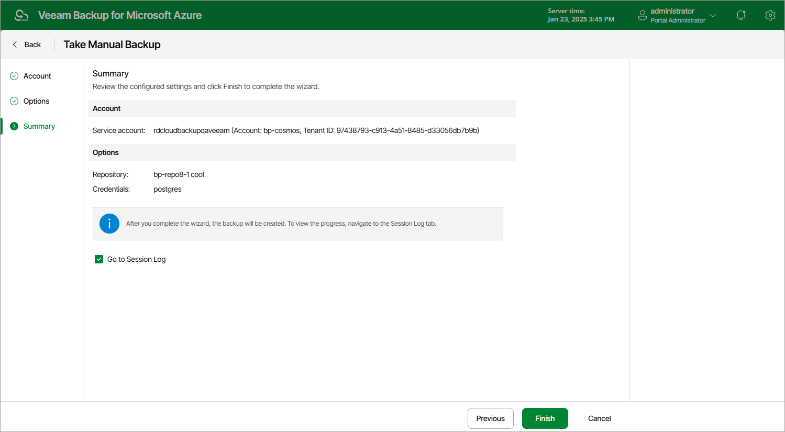

# Creating Cosmos DB Backups Manually

Veeam Backup for Microsoft Azure allows you to manually create backups of Cosmos DB for PostgreSQL and Cosmos DB for MongoDB accounts.

|  |
| --- |
| Note |
| Veeam Backup for Microsoft Azure does not include backups of Cosmos DB accounts created manually in the backup chain and does not apply the [configured retention policy settings](cosmos_db_backup_policy_schedule.md) to these backups. This means that the backups are kept in the repository unless you remove them manually, as described in section [Cosmos DB Data](removing_cosmos_db_backups.md). |

To manually create backups of Cosmos DB for PostgreSQL and Cosmos DB for MongoDB accounts, do the following:

1. Navigate to Resources > Databases > Cosmos DB.
2. Select the check box next to the necessary Cosmos DB for PostgreSQL and Cosmos DB for MongoDB accounts and click Take Backup Now.

For the accounts to be displayed in the list of available resources, they must reside in any region included in a backup policy as described in section [Creating Cosmos DB Backup Policies](cosmos_db_backup_source_settings.md#regions) (step 3b).

1. Complete the Take Manual Backup wizard:

1. At the Account step of the wizard, select a service account whose permissions Veeam Backup for Microsoft Azure will use to create backups.

For an account to be displayed in the accounts list, it must be added to Veeam Backup for Microsoft Azure as described in section [Adding Service Accounts](service_account_add.md).

1. At the Options step of the wizard, do the following:

1. In the Backup target section, click Choose repository.

In the Choose repository window, select a repository where the created backups will be stored. For a repository to be displayed in the Repository list, it must be added to Veeam Backup for Microsoft Azure, must have the Hot or Cool access tier assigned and must have immutability disabled, as described in section [Adding Backup Repositories](repository_add_ui.md) or [Adding Storage Vaults](repository_vdc_add_ui.md).

1. In the Processing options section, specify credentials that Veeam Backup for Microsoft Azure will use to connect to the processed Cosmos DB for PostgreSQL accounts. For more information, see [Configure Processing Options](cosmos_db_processing_options.md).

1. At the Summary step of the wizard, review summary information, choose whether you want to proceed to the Session Log page to track the progress of repository creation, and click Finish.

