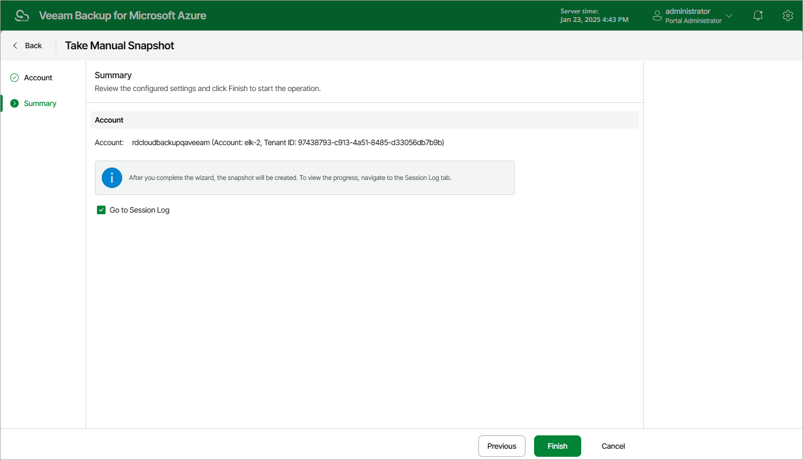

# Creating File Share Snapshots Manually

Veeam Backup for Microsoft Azure allows you to manually create snapshots of Azure file shares. Each snapshot is saved to the same Azure region in which the protected Azure file share resides.

|  |
| --- |
| Note |
| Veeam Backup for Microsoft Azure does not include snapshots created manually in the snapshot chain and does not apply the [configured retention policy settings](fs_backup_policy_schedule.md) to these snapshots. This means that the snapshots are kept in your Microsoft Azure environment unless you remove them manually, as described in section [Azure Files Data](managing_azure_files.md). |

To manually create a cloud-native snapshot of an Azure file share, do the following:

1. Navigate to Resources > Azure Files.
2. Select the check box next to the necessary Azure file share and click Take Snapshot Now.

For an Azure file share to be displayed in the list of available resources, it must reside in any region included in a backup policy as described in section [Creating Azure Files Backup Policies](fs_backup_source_settings.md) (step 3b).

1. Complete the Take Manual Snapshot wizard:

1. At the Account step of the wizard, select a service account whose permissions Veeam Backup for Microsoft Azure will use to create a snapshot.

For an account to be displayed in the accounts list, it must be added to Veeam Backup for Microsoft Azure as described in section [Adding Service Accounts](service_account_add.md).

1. At the Summary step of the wizard, review configuration information, choose whether you want to proceed to the [Session Log page](session_statistics.md) to track the progress of snapshot creation, and click Finish.

