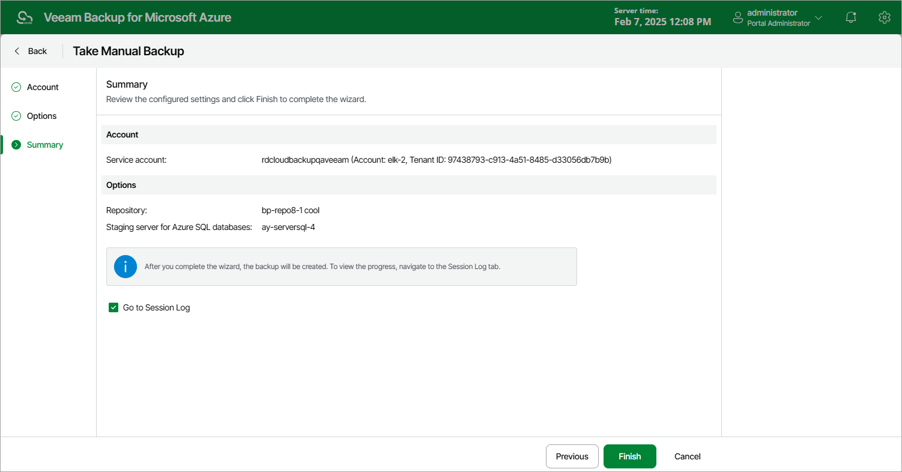

# Creating SQL Backups Manually

Veeam Backup for Microsoft Azure allows you to manually create backups of Azure SQL databases.

|  |
| --- |
| Note |
| Veeam Backup for Microsoft Azure does not include backups of Azure SQL databases created manually in the backup chain and does not apply the [configured retention policy settings](sql_backup_policy_schedule.md) to these backups. This means that the backups are kept in the repository unless you remove them manually, as described in section [Managing SQL Data](removing_sql_backups.md). |

To manually create a backup of an Azure SQL database, do the following:

1. Navigate to Resources > Databases > Azure SQL.
2. Select the check box next to the necessary Azure SQL database and click Take Backup Now.

For an Azure SQL database to be displayed in the list of available resources, it must reside in any region included in a backup policy as described in section [Creating SQL Backup Policies](sql_backup_source_settings.md#regions) (step 3b).

1. Complete the Take Manual Backup wizard:

1. At the Account step of the wizard, select a service account whose permissions Veeam Backup for Microsoft Azure will use to create a backup.

For an account to be displayed in the accounts list, it must be added to Veeam Backup for Microsoft Azure as described in section [Adding Service Accounts](service_account_add.md).

1. At the Options step of the wizard, do the following:

1. In the Backup target section, click Choose backup repository.

In the Specify the backup repository window, select a repository where the created backup will be stored. For a backup repository to be displayed in the Repository list, it must be added to Veeam Backup for Microsoft Azure, must have the Hot or Cool access tier assigned and must have immutability disabled, as described in section [Adding Backup Repositories](repository_add_ui.md) or [Adding Storage Vaults](repository_vdc_add_ui.md).

1. In the Specify database processing settings section, choose whether you want to use a staging server to perform backup. For more information, see [Configure Processing Options](sql_processing_options.md).

1. At the Summary step of the wizard, review configuration information, choose whether you want to proceed to the [Session Log page](session_statistics.md) to track the progress of backup creation, and click Finish.

