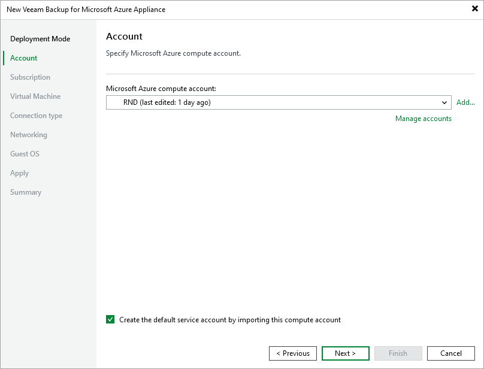

In this article

At the Account step of the wizard, select a Microsoft Azure compute account whose permissions will be used to deploy the new backup appliance. By default, Veeam Backup & Replication will also use the Microsoft Entra application associated with the Microsoft Azure compute account to create a default service account on the backup appliance. If you do not want Veeam Backup & Replication to create the default service account, make sure the Create the default service account by importing this compute account check box is not selected.

|  |
| --- |
| Note |
| Out of the box, Veeam Backup for Microsoft Azure does not create any default service accounts for standalone backup appliances — only Veeam Backup & Replication can automatically create such an account in Veeam Backup for Microsoft Azure during the backup appliance deployment from the Veeam Backup & Replication console. |

For a Microsoft Azure compute account to be displayed in the Microsoft Azure compute account drop-down list, it must be added to the Cloud Credentials Manager as described in the Veeam Backup & Replication User Guide, section [Microsoft Azure Compute Accounts](https://helpcenter.veeam.com/docs/vbr/userguide/restore_azure_acc_name.html?ver=13). If you have not added the necessary account to the Cloud Credentials Manager beforehand, you can do it without closing the New Veeam Backup for Microsoft Azure Appliance wizard. To do that, click either the Manage accounts link or the Add button, and complete the Microsoft Azure Compute Account wizard.

When completing the Microsoft Azure Compute Account wizard, you will have 2 options at the Account Type step — either to use an existing or to create a new Microsoft Entra application:

* If you select the Create a new account option, Veeam Backup & Replication will create a new Microsoft Entra application in your Microsoft Entra ID.

The newly created application will be automatically assigned the Key Vault Crypto User, Owner and Storage Queue Data Contributor [Azure built-in roles](https://learn.microsoft.com/en-us/azure/role-based-access-control/built-in-roles). Note that the Owner role has a wide scope of permissions and capabilities, which is required for the Microsoft Azure Compute account to perform restore operations in Veeam Backup & Replication. That is why it is not recommended that you unassign any operational roles from the default service account in Veeam Backup for Microsoft Azure — if you want the application to be assigned a [limited list of permissions](plugin_permissions.md), manually create a Microsoft Entra application in Microsoft Azure as described in [Microsoft Docs](https://docs.microsoft.com/en-us/azure/active-directory/develop/howto-create-service-principal-portal#create-an-azure-active-directory-application).

* If you select the Use the existing account option, Veeam Backup & Replication will use the scope of permissions assigned to an existing Microsoft Entra application.

For Veeam Backup & Replication to be able to connect to the application, it must be created in Microsoft Azure as described in [Microsoft Docs](https://docs.microsoft.com/en-us/azure/active-directory/develop/howto-create-service-principal-portal#create-an-azure-active-directory-application), and must have all the permissions required to perform backup and restore operations. For the list of required permissions, see [Plug-In Permissions](plugin_permissions.md).

To provide permissions to the application, you must [create a custom role](https://learn.microsoft.com/en-us/azure/role-based-access-control/custom-roles-portal#prerequisites) in Microsoft Azure, [grant the necessary permissions](https://learn.microsoft.com/en-us/azure/role-based-access-control/custom-roles-portal#start-from-json) to this role, and then [assign the role](https://docs.microsoft.com/en-us/azure/role-based-access-control/role-assignments-portal?tabs=current) to the application.

|  |
| --- |
| Important |
| Microsoft Azure Stack Hub accounts are not supported. For more information, see [Microsoft Docs](https://learn.microsoft.com/en-us/azure-stack/operator/azure-stack-overview?view=azs-2206). |

Related Topics

[Editing Service Accounts](service_account_edit.md)

Page updated 8/19/2025

Page content applies to build 8.0.1.202
