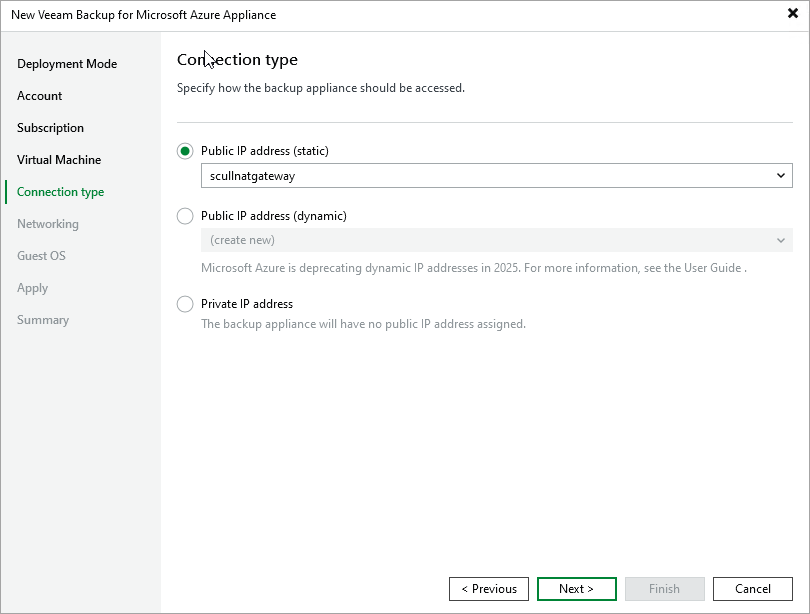

In this article

At the Connection Type step of the wizard, choose whether you want to assign a dynamic or a static public IP address, or a private IP address to the backup appliance. After the backup appliance is deployed, Veeam Backup & Replication will use the specified connection type to connect to the appliance.

To assign a dynamic or static IP address, you can either reserve a new address or specify an existing one:

* To reserve a new IP address, select the (create new) option from the drop-down list.
* To assign an existing IP address, select it from the drop-down list. For an IP address to be displayed in the list of available IP addresses, it must be reserved in Microsoft Azure as described in [Microsoft Docs](https://learn.microsoft.com/en-us/azure/virtual-network/ip-services/virtual-network-network-interface-addresses#add-ip-addresses).

|  |
| --- |
| Note |
| On September 30, 2025, dynamic (Basic SKU) public IP addresses will be retired in Microsoft Azure. That is why it is recommended that you select a static IP address. For more information, see [Microsoft Docs](https://azure.microsoft.com/en-us/updates/upgrade-to-standard-sku-public-ip-addresses-in-azure-by-30-september-2025-basic-sku-will-be-retired/). |

If you choose the Private IP address option, you must allow communication between the Veeam Backup & Replication server and the backup appliance. If your backup appliance resides in the same virtual network as the Veeam Backup & Replication server, the communication will be established using private IP addresses. If the backup appliance and the Veeam Backup & Replication server reside in different virtual networks, one possible solution is to establish a Site-to-Site VPN connection between the virtual network of the appliance and your on-premises network. To allow your backup appliance to perform all backup and restore operations in the private environments, you will need to perform additional configuration actions as described in section [Working in Private Environments](app_private_network.md).

Page updated 7/9/2025

Page content applies to build 8.0.1.202
