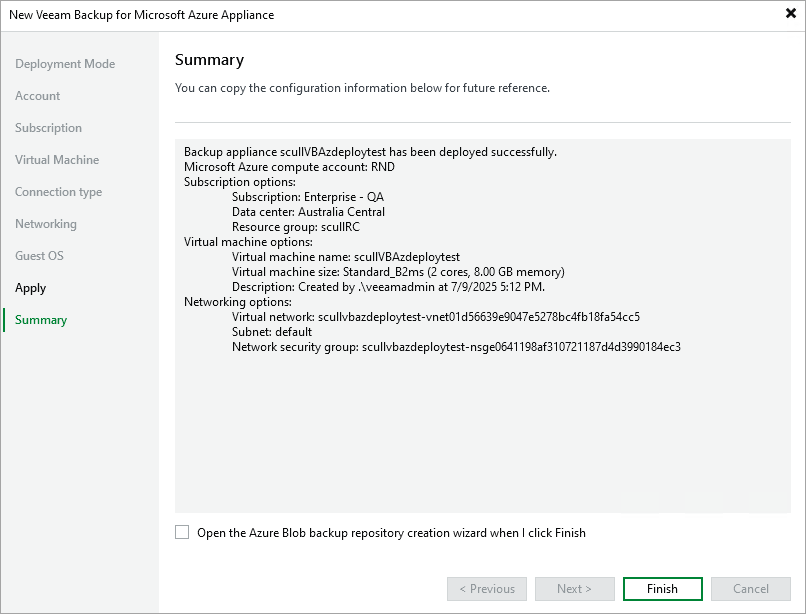

In this article

At the Summary step of the wizard, review summary information and click Finish. After the backup appliance is deployed, you will be able to configure its settings in the Veeam Backup for Microsoft Azure Web UI as described in section [Configuring Veeam Backup for Microsoft Azure](configuration.md).

|  |
| --- |
| Tip |
| If you want to configure repositories immediately after the backup appliance is deployed, select the Open the Azure Blob backup repository creation wizard when I click Finish check box and follow the instructions provided in section [Adding Repositories](repository_add_console.md). |

Page updated 7/9/2025

Page content applies to build 8.0.1.202
