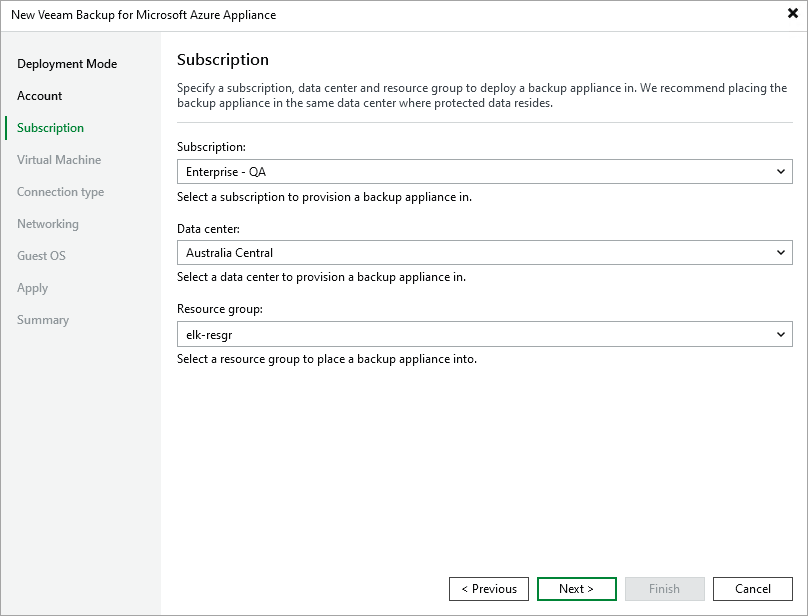

In this article

At the Subscription step of the wizard, do the following:

1. From the Subscription drop-down list, select an Azure subscription that will be used to manage costs of the backup appliance.

For a subscription to be displayed in the list of available subscriptions, it must be [created in Microsoft Azure](https://learn.microsoft.com/en-us/azure/cost-management-billing/manage/create-subscription) and [associated with the Microsoft Entra tenant](https://docs.microsoft.com/en-us/azure/active-directory/fundamentals/active-directory-how-subscriptions-associated-directory) to which the Microsoft Azure compute account specified at [step 3](deploying_appliance_account.md) belongs.

1. From the Data center drop-down list, select an Azure region in which the backup appliance will reside.

For more information on Azure regions, see [Microsoft Docs](https://learn.microsoft.com/en-us/azure/virtual-machines/regions).

1. Choose a resource group that will hold resources related to the appliance.

You can create a new resource group or specify an existing one:

* To create a new resource group, select the (create new) option from the Resource group drop-down list. Veeam Backup & Replication will automatically create the veeam-<VMname>-rg<GUID> resource group.
* To specify an existing resource group, select it from the Resource group drop-down list. For a resource group to be displayed in the list of available resource groups, it must be created in Microsoft Azure as described in [Microsoft Docs](https://docs.microsoft.com/en-us/azure/azure-resource-manager/management/manage-resource-groups-portal).

Page updated 8/20/2025

Page content applies to build 8.0.1.202
