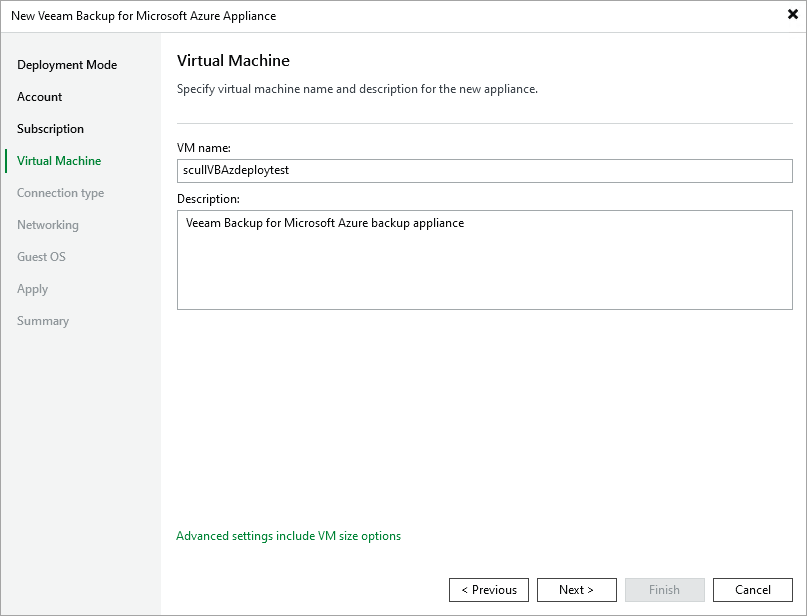

In this article

At the Virtual Machine step of the wizard, specify a name and description for the Azure VM on which Veeam Backup for Microsoft Azure will be deployed. Note that the name must meet the [Microsoft Azure resource name rules](https://docs.microsoft.com/en-us/azure/azure-resource-manager/management/resource-name-rules#microsoftcompute).

Page updated 7/9/2025

Page content applies to build 8.0.1.202
