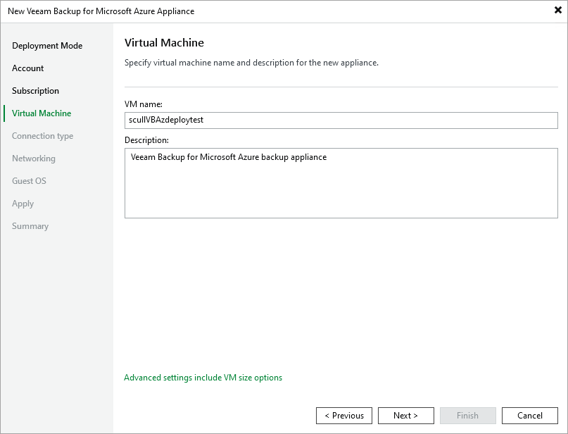

# Step 5. Specify VM Instance Name and Description

At the Virtual Machine step of the wizard, specify a name and description for the Azure VM on which Veeam Backup for Microsoft Azure will be deployed. Note that the name must meet the [Microsoft Azure resource name rules](https://docs.microsoft.com/en-us/azure/azure-resource-manager/management/resource-name-rules#microsoftcompute).

|  |
| --- |
| Tip |
| By default, Veeam Backup & Replication uses the minimum recommended B2ms VM size for the backup appliance. If you want to choose a specific VM size, click Choose VM size (optional) and select the necessary size in the VM Size window.  For the list of recommended VM sizes, see [Sizing and Scalability Guidelines](sizing_appliance.md). Keep in mind that in Veeam Backup for Microsoft Azure version 8.1, you can only choose the B2ms, F4s\_v2 or F8s\_v2 VM size. |

