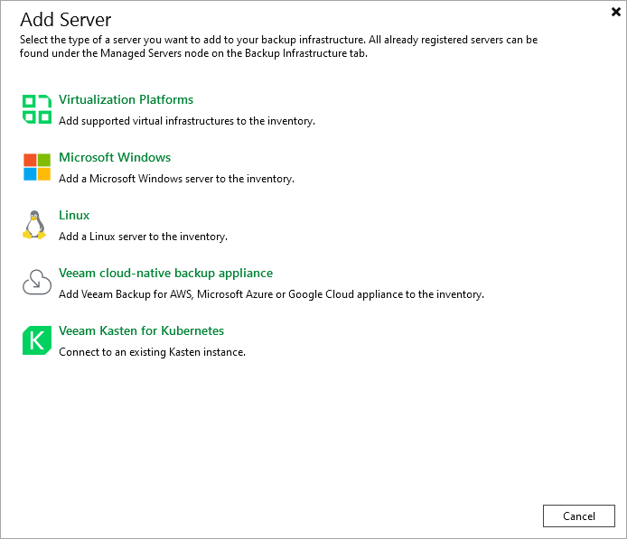

# Step 1. Launch New Veeam Backup for Microsoft Azure Appliance Wizard

To launch the New Veeam Backup for Microsoft Azure Appliance wizard, do the following:

1. In the Veeam Backup & Replication console, open the Backup Infrastructure view.
2. Navigate to Managed Servers and click Add Server on the ribbon.

Alternatively, you can right-click the Managed Servers node and select Add Server.

1. In the Add Server window:

1. [Applies only if you have several cloud plug-ins installed] Click Veeam cloud-native backup appliance.
2. Choose Veeam Backup for Microsoft Azure.

Related Resources

[Veeam Backup & Replication UI](https://helpcenter.veeam.com/docs/vbr/userguide/vbr_ui.html?ver=13) in the Veeam Backup & Replication User Guide

