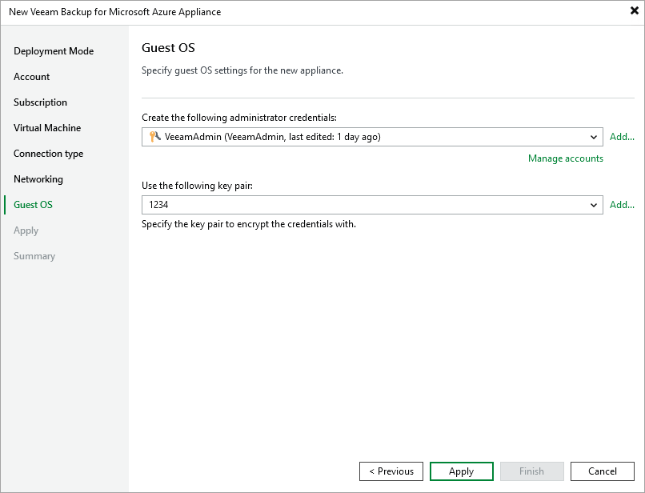

In this article

At the Guest OS step of the wizard, do the following:

1. From the Create the following administrator credentials drop-down list, select a user whose credentials will be used by Veeam Backup & Replication to create the Default Admin account on the backup appliance.

For a user to be displayed in the Create the following administrator credentials drop-down list, it must be added to the Credentials Manager as described in the Veeam Backup & Replication User Guide, section [Standard Accounts](https://helpcenter.veeam.com/docs/vbr/userguide/credentials_manager_windows.html?ver=13). If you have not added the necessary user to the Credentials Manager beforehand, you can do it without closing the New Veeam Backup for Microsoft Azure Appliance wizard. To do that, click either the Manage accounts link or the Add button, and specify the user name, password and description in the Credentials window.

|  |
| --- |
| Note |
| When you specify user credentials, Veeam Backup & Replication automatically verifies the provided password. If the password does not meet the [Microsoft security requirements](https://learn.microsoft.com/en-us/azure/virtual-machines/linux/faq#what-are-the-password-requirements-when-creating-a-vm-), or if the password is present in any of the [Ubuntu 22.04 LTS cracklib dictionaries](https://manpages.ubuntu.com/manpages/jammy/en/man8/cracklib-format.8.html), you will get an error message notifying you that the password cannot be verified. |

1. In the Use the following key pair field, select a key pair that will be used to authenticate against the backup appliance.

For a key pair to be displayed in the list of available key pairs, it must be created in Microsoft Azure as described in [Microsoft Docs](https://learn.microsoft.com/en-us/azure/virtual-machines/ssh-keys-portal). If you have not created the necessary key pair beforehand, you can do it without closing the New Veeam Backup for Microsoft Azure wizard. To do that, click Add and specify the key pair name and folder path to the pair in the New Key Pair window.

|  |
| --- |
| Note |
| Consider the following:   * If you choose to create a new key pair, the key pair will be stored in the resource group specified at [step 4](deploying_appliance_subscription.md). However, if you have selected the (create new) option when specifying the resource group, Veeam Backup & Replication will store the created key pair in the VeeamSSHKeys resource group. * If you change the password of the Default Admin account on the backup appliance, you must also change this user password in the Veeam Backup & Replication console as described in the Veeam Backup & Replication User Guide, section [Editing and Deleting Credentials Records](https://helpcenter.veeam.com/docs/vbr/userguide/credentials_edit_delete.html?ver=13). Otherwise, the connection will not be established. |

Page updated 8/20/2025

Page content applies to build 8.0.1.202
