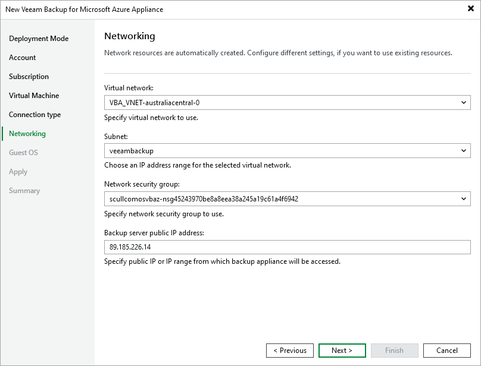

# Step 7. Specify Network Settings

At the Networking step of the wizard, do the following:

1. Choose a virtual network to which the backup appliance will be connected.

You can create a new network or specify an existing one:

* [Applies only if you have chosen to assign a public IP address to the backup appliance at the Connection Type step of the wizard] To create a new virtual network, select the (create new) option from the Virtual network drop-down list. Veeam Backup & Replication automatically create a network with a set of predefined security rules.
* To specify an existing virtual network, select it from the Virtual network drop-down list. For a virtual network to be displayed in the list of available networks, it must be created in Microsoft Azure for the region specified at [step 4](deploying_appliance_subscription.md) as described in [Microsoft Docs](https://learn.microsoft.com/en-us/azure/virtual-network/quick-create-portal).

1. Choose a subnet to which the backup appliance will be connected.

You can create a new subnet or specify an existing one:

* [Applies only if you have selected the create new option from the Virtual network drop-down list] To create a new subnet, select the (create new) option from the Subnet drop-down list. Veeam Backup & Replication will automatically create a subnet in the specified virtual network.
* To specify an existing subnet, select it from the Subnet drop-down list. For a subnet to be displayed in the list of available subnets, it must be created in the specified virtual network as described in [Microsoft Docs](https://learn.microsoft.com/en-us/azure/virtual-network/virtual-network-manage-subnet).

1. Choose a network security group that will be associated with the backup appliance.

You can create a new security group or specify an existing one:

* To create a new security group, select the (create new) option from the Network security group drop-down list. Veeam Backup & Replication will automatically create a group.
* To specify an existing security group, select it from the Network security group drop-down list. For a security group to be displayed in the list of available groups, it must be created in Microsoft Azure as described in [Microsoft Docs](https://learn.microsoft.com/en-us/azure/virtual-network/tutorial-filter-network-traffic#create-a-network-security-group).

|  |
| --- |
| Important |
| If you select an existing security group, consider that security rules added to the group must allow inbound internet access from both the backup server and a local machine that you plan to use to work with Veeam Backup for Microsoft Azure. To learn how to create security rules, see [Microsoft Docs](https://learn.microsoft.com/en-us/azure/virtual-network/tutorial-filter-network-traffic#create-security-rules). |

1. [Applies only if you have chosen to assign a public IP address to the backup appliance at the Connection Type step of the wizard] In the Backup server public IP address field, specify an IP address or a range of IP addresses that will be allowed to access the backup appliance.

* If you have chosen to create a new security group, Veeam Backup & Replication will create a security rule for the specified specified IP address ranges. Note that the backup server IP address must fall into the specified IP address range.
* If you have chosen to specify an existing security group, Veeam Backup & Replication will verify whether the security group allows inbound HTTPS traffic (port 443) from the specified IP addresses. If the security group restricts inbound HTTPS traffic, you will not be able to proceed with the wizard.

1. [Applies only if you have chosen to assign a private IP address to the backup appliance at the Connection Type step of the wizard] In the Backup server IP address field, specify an IP address or a range of IP addresses that will be allowed to access the backup appliance. Note that the backup server IP address must fall into the specified IP address range.

Veeam Backup & Replication will verify whether the specified security group allows inbound HTTPS traffic (port 443) from the specified IP addresses. If the security group restricts inbound HTTPS traffic, the deployment will fail.

|  |
| --- |
| Tip |
| The IPv4 address ranges must be specified in the CIDR notation (for example, 12.23.34.0/24). To specify multiple IP addresses or multiple IP address ranges, use a comma-separated list. |

