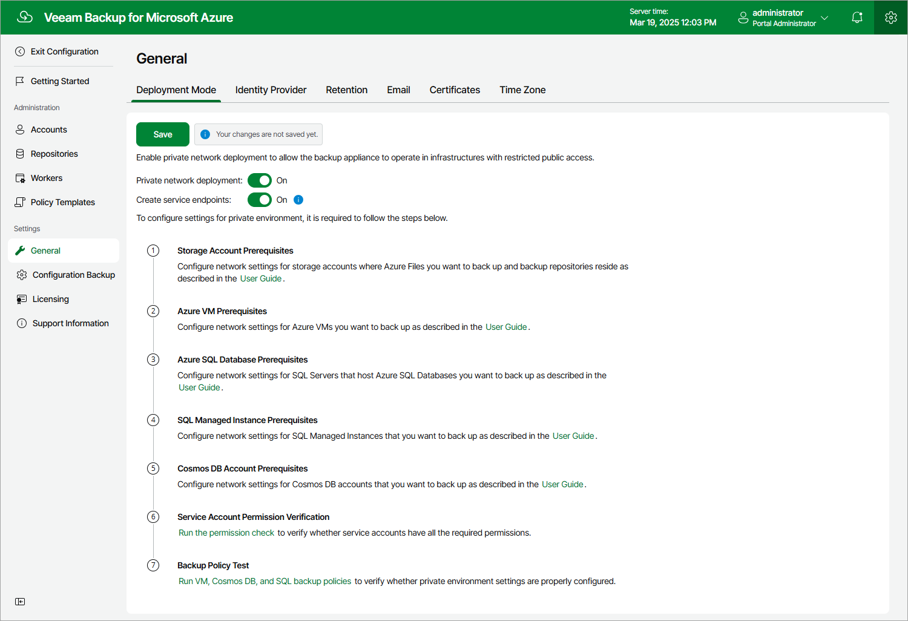
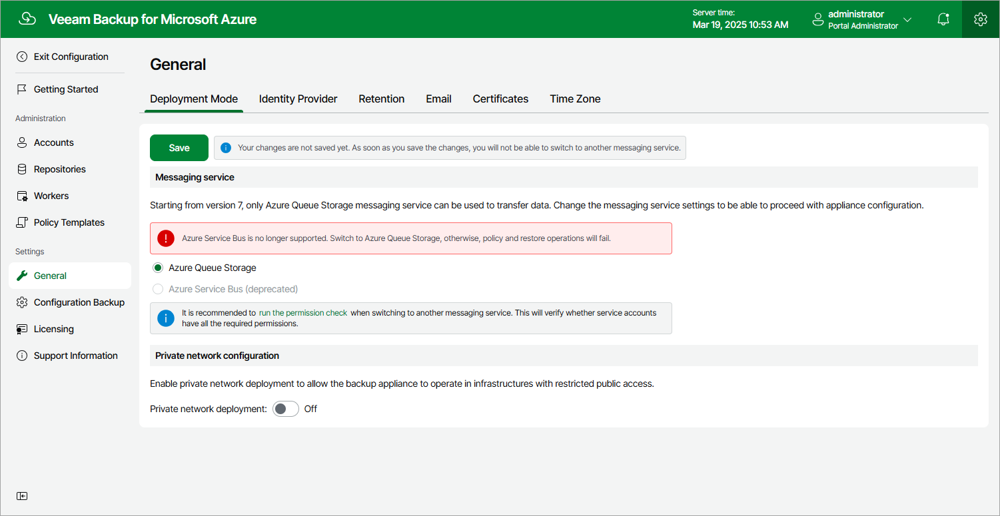

In this article

By default, worker instances launched by Veeam Backup for Microsoft Azure access protected Azure resources through public virtual networks. If you want worker instances to process resources that reside in private virtual networks, you can enable the private network deployment functionality and instruct Veeam Backup for Microsoft Azure to launch worker instances without public IPv4 addresses. In this case, Veeam Backup for Microsoft Azure will automatically configure worker settings to allow private network access; however, you will also need to perform a number of configuration steps manually as described in section [Working in Private Environments](app_private_network.md).

To enable the private network deployment functionality, do the following:

1. Switch to the Configuration page, navigate to General > Deployment Mode and set the Private network deployment toggle to On.

1. By design, Veeam Backup for Microsoft Azure automatically creates a virtual network service endpoint for the Microsoft.Storage.Global service to communicate with worker instances in public virtual networks. However, for worker instances operating in private environments, you must do either of the following:

* Configure the virtual network service endpoint manually in Microsoft Azure as described in [Microsoft Docs](https://docs.microsoft.com/en-us/azure/virtual-network/virtual-network-service-endpoints-overview).
* Set the Create service endpoints toggle to On.

1. To allow Veeam Backup for Microsoft Azure to launch the worker instances while backing up unmanaged Azure VMs and file shares, configure network settings for your storage accounts as described in section [Configuring Network Settings for Storage Accounts](app_pne_storage_account.md).
2. To allow Veeam Backup for Microsoft Azure to back up Azure VMs in a private environment, configure network settings for these VMs as described in section [Configuring Network Settings for VM Backup](app_pne_vm_backup.md).
3. To allow Veeam Backup for Microsoft Azure to launch the worker instances while backing up SQL Servers, configure network settings for these servers as described in section [Configuring Network Settings for SQL Servers](app_pne_sql.md).
4. To allow Veeam Backup for Microsoft Azure to launch the worker instances while backing up SQL Managed Instances, configure network settings for these instances as described in section [Configuring Network Settings for SQL Managed Instances](app_pne_managed_instance.md).
5. To allow Veeam Backup for Microsoft Azure to to back up Cosmos DB accounts in a private environment, configure network settings for these accounts as described in section [Configuring Networking Settings for Cosmos DB Accounts](app_pne_cosmos_db.md).
6. To check whether you have configured all the necessary settings correctly, run your backup policies as described in section [Performing Backup](backup.md).

|  |
| --- |
| Important |
| When you enable private network deployment for a backup appliance running Veeam Backup for Microsoft Azure version 8.1, make sure that the subnet to which worker instances will be connected has at least 3 free IP addresses per Azure region where worker instances are launched during backup and restore operations. Otherwise, the subnet may run out of free IP addresses and deplete.  For upgraded appliances that had private network deployment enabled before version 8, Veeam Backup for Microsoft Azure uses the subnet where an appliance is deployed. If you want Veeam Backup for Microsoft Azure to use the subnet to which worker instances will be connected, you must manually remove all the private endpoints from the subnet in which the backup appliance is deployed. |

After you enable the private network deployment functionality, it is recommended that you check whether service accounts have all the permissions required to use this functionality as described in section [Checking Service Account Permissions](service_account_check.md).

Choosing Messaging Service

[Applies only to upgraded appliances that still use Azure Service Bus as a messaging service]

Veeam Backup for Microsoft Azure uses a messaging service to allow communication between the architecture components. In versions prior to 7.0, Veeam Backup for Microsoft Azure used the Azure Service Bus messaging service by default. In version 7.0, Azure Service Bus was replaced by Azure Queue Storage. That is why you must manually switch to the Azure Queue Storage service immediately after you upgrade the backup appliance — otherwise, Veeam Backup for Microsoft Azure will fail to perform backup and restore operations. For more information on the Azure Queue Storage messaging service, see [Microsoft Docs](https://learn.microsoft.com/en-us/azure/storage/queues/storage-queues-introduction).

|  |
| --- |
| Important |
| After you switch to the Azure Queue Storage service, you must do the following:   1. Check whether service accounts have all the permissions required to use this service, as described in section [Checking Service Account Permissions](service_account_check.md). 2. Manually remove from Microsoft Azure the Service Bus premium namespaces created by Veeam Backup for Microsoft Azure. To do that:  1. Sign in to the Microsoft Azure portal using credentials of the Microsoft Azure account that you used to install Veeam Backup for Microsoft Azure. 2. Navigate to Resource groups and click the resource group in which the backup appliance is deployed. 3. In the Resources section on the resource group page, enter veeam in the search field. 4. In the Resources list, select check boxes next to the resources of the Service Bus namespace type and click Delete. 5. In the Delete Resources window, type Yes to confirm the action and click Delete. |

Page updated 1/13/2026

Page content applies to build 8.0.1.202
