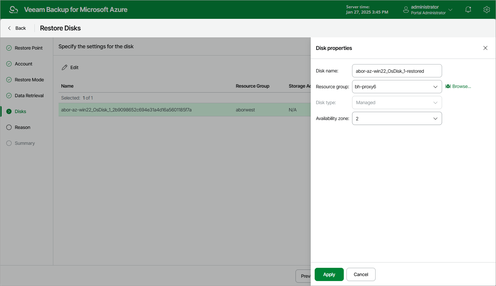

# Step 6. Specify Disk Settings

[This step applies only if you have selected the Restore to a new location, or different settings option at the Restore Mode step of the wizard]

At the Disks step of the wizard, you can configure disk properties for each restored virtual disk:

1. Select the necessary disk.
2. Click Edit.
3. In the Disk properties window, do the following:

1. In the Disk name field, specify a new name for the restored virtual disk.
2. From the Resource group drop-down list, select a resource group to which the restored virtual disk will belong.

For a resource group to be displayed in the list of available resource groups, it must be created in the Microsoft Azure portal as described in [Microsoft Docs](https://docs.microsoft.com/en-us/azure/azure-resource-manager/management/manage-resource-groups-portal).

1. From the Disk type drop-down list, select a type for the restored virtual disk. For more information on disk types, see [Microsoft Docs](https://docs.microsoft.com/en-us/azure/virtual-machines/windows/managed-disks-overview).

|  |
| --- |
| Note |
| You cannot convert managed virtual disks into unmanaged, but you can convert unmanaged virtual disks into managed. |

1. [Applies only to unmanaged disks] From the Storage account drop-down list, select an Azure storage account to which you want to restore the selected virtual disk.

For a storage account to be displayed in the Storage account list, it must be created in the Microsoft Azure portal as described in [Microsoft Docs](https://docs.microsoft.com/en-us/azure/storage/common/storage-account-create?tabs=azure-portal#create-a-storage-account).

1. [Applies only to managed disks] From the Availability zone drop-down list, select an availability zone to which you want to place the restored virtual disk.

1. To save changes made to the virtual disk settings, click Apply.

