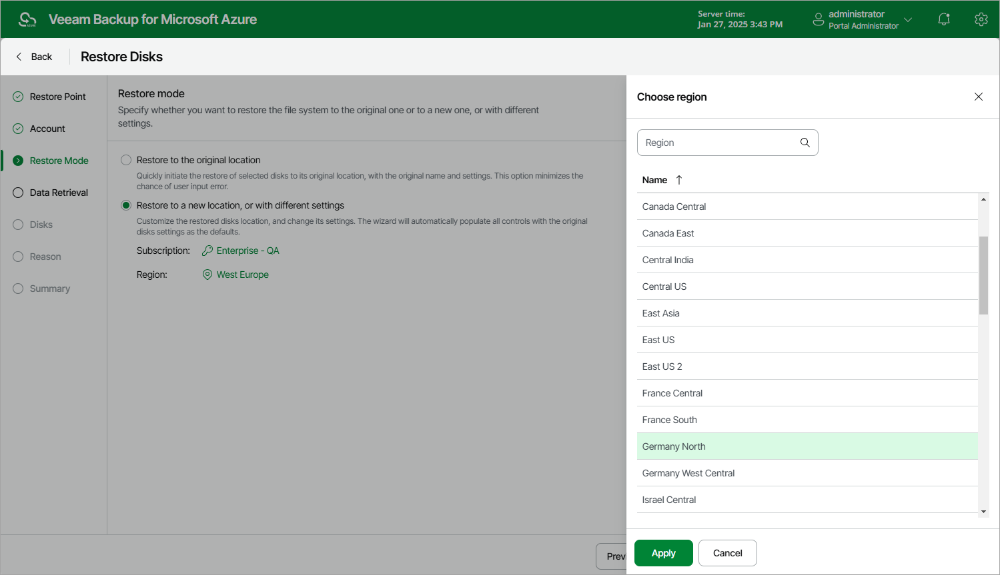

In this article

At the Restore Mode step of the wizard, choose whether you want to restore the selected virtual disks to the original or to a custom location.

If you select the Restore to a new location, or with different settings option, you must also select an Azure subscription and an Azure region in which the restored virtual disks will reside:

1. Click the link in the Subscription field. Then, select the necessary subscription in the Choose subscription window.

For a subscription to be displayed in the list of available subscriptions, it must be [created in Microsoft Azure](https://learn.microsoft.com/en-us/azure/cost-management-billing/manage/create-subscription) and [associated with the Microsoft Entra tenant](https://docs.microsoft.com/en-us/azure/active-directory/fundamentals/active-directory-how-subscriptions-associated-directory) to which the service account specified at [step 3](disk_restore_account.md) belongs.

1. Click the link in the Region field. Then, select the necessary Azure region in the Choose region window.

|  |
| --- |
| Notes |
| * If you choose to restore the disks to the original location, keep in mind that Veeam Backup for Microsoft Azure will restore the disks to the Azure resource group to which the related Azure VM belongs, even if these disks originally belonged to another resource group. * Data transfer to a new location may require additional costs and may take more time to complete. |

Page updated 8/20/2025

Page content applies to build 8.0.1.202
