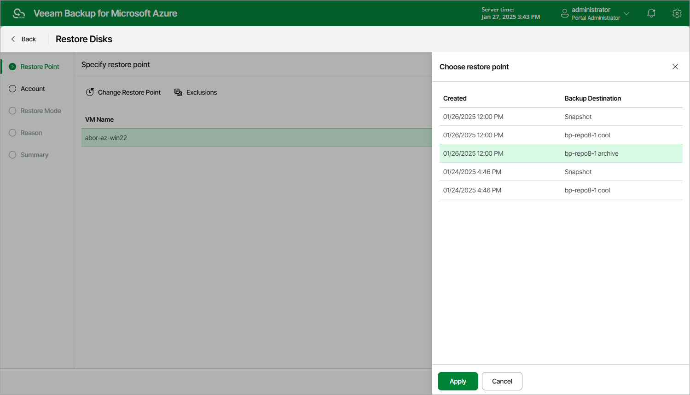

In this article

At the Restore Point step of the wizard, select a restore point that will be used to restore virtual disks of the selected Azure VM. By default, Veeam Backup for Microsoft Azure uses the most recent valid restore point. However, you can restore the disks to an earlier state.

|  |
| --- |
| Important |
| If you select a restore point stored in an archive repository and the same restore point is also available in a regular repository, Veeam Backup for Microsoft Azure will display the confirmation window where you must choose whether you want to use the archived or regular restore point to perform the restore operation. |

To select a restore point, do the following:

1. Select the Azure VM.
2. Click Change Restore Point.
3. In the Specify restore point window, select the necessary restore point and click Apply.

To help you choose a restore point, Veeam Backup for Microsoft Azure provides the following information on each available restore point:

* Created — the date when the restore point was created.
* Backup Destination — the type of the restore point:

* <Repository Name> — an image-level backup created by a backup policy.
* Snapshot — a cloud-native snapshot created by a backup policy.
* Manual Snapshot — a cloud-native snapshot created manually.

|  |
| --- |
| Tip |
| If you want to restore only specific virtual disks of the selected Azure VM, you can exclude the unnecessary disks from the restore process. To do that, click Exclusions to open the Select exclusions window, select check boxes next to the disks that you do not want to restore, and click Apply. |

Page updated 1/27/2025

Page content applies to build 8.0.1.202
