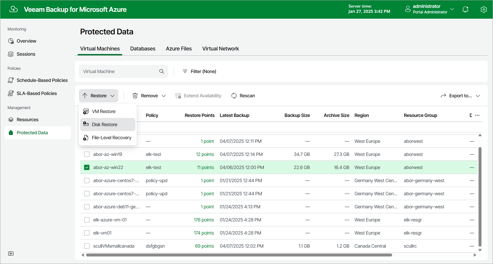

In this article

To launch the Restore Disks wizard, do the following:

1. Navigate to Protected Data > Virtual Machines.
2. Select the Azure VM whose virtual disks you want to restore.
3. Click Restore > Disk Restore.

You can also click the link in the Restore Points column. Then, in the Restore Points window, select the necessary restore point and click Restore > Disk Restore.

Page updated 3/17/2025

Page content applies to build 8.0.1.202
