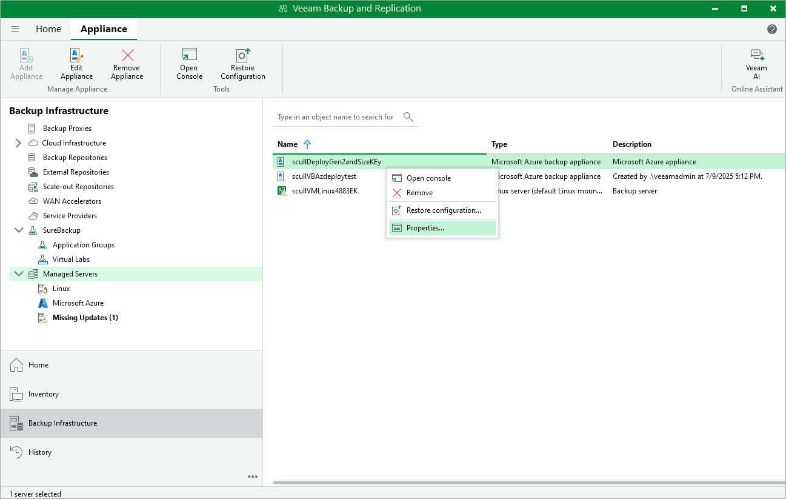

In this article

For each backup appliance managed by the backup server, you can modify the settings configured while adding the appliance to the backup infrastructure.

To edit the backup appliance settings, do the following:

1. In the Veeam Backup & Replication console, open the Backup Infrastructure view.
2. Navigate to Managed Servers.
3. Select the necessary appliance and click Edit Appliance on the ribbon.

Alternatively, right-click the appliance and select Properties.

1. Complete the Edit Veeam Backup for Microsoft Azure Appliance wizard:

1. To change the Microsoft Azure compute account that is used to connect to the backup appliance, follow the instructions provided in section [Connecting to Existing Appliances](adding_appliance_account.md) (step 3).
2. To provide a new description for the backup appliance, follow the instructions provided in section [Connecting to Existing Appliances](adding_appliance_vm.md) (step 5).
3. To change the way Veeam Backup & Replication connects to the backup appliance, follow the instructions provided in section [Connecting to Existing Appliances](adding_appliance_connection.md) (step 6).
4. To change the user whose credentials Veeam Backup & Replication uses to connect to the backup appliance, follow the instructions provided in section [Connecting to Existing Appliances](adding_appliance_credentials.md) (step 7).
5. To edit settings of the backup appliance repositories added to the backup infrastructure, follow the instructions provided in section [Connecting to Existing Appliances](adding_appliance_repository.md) (step 8).
6. At the Summary step of the wizard, review summary information and click Finish.

|  |
| --- |
| Note |
| As soon as you click Next at step c, Veeam Backup & Replication will verify the connection to the specified backup appliance. If the appliance is assigned a dynamic IP address, Veeam Backup & Replication will display a warning notifying that dynamic IP addresses will be retired in 2025. To learn how to eliminate this warning, see [Eliminating Warnings](eliminating_warnings.md). |

Page updated 7/10/2025

Page content applies to build 8.0.1.202
