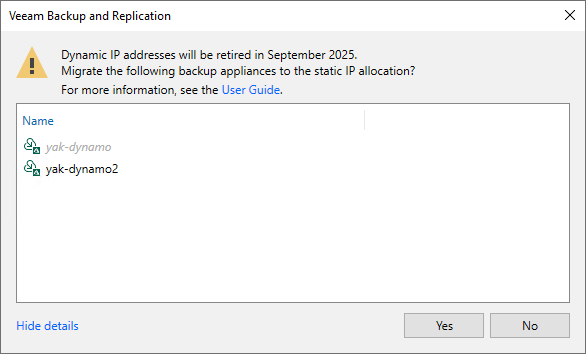

In this article

On September 30, 2025, dynamic (Basic SKU) public IP addresses will be [retired in Microsoft Azure](https://azure.microsoft.com/en-us/updates/upgrade-to-standard-sku-public-ip-addresses-in-azure-by-30-september-2025-basic-sku-will-be-retired/). That is why starting from Veeam Backup for Microsoft Azure version 7.0, Veeam Backup & Replication checks the IP allocation method specified for backup appliances in case the following conditions are met:

* An available update is detected for any of these backup appliances.
* You either log in to the backup server, edit settings of a backup appliance, or upgrade one or multiple backup appliances.

In this case, Veeam Backup & Replication will display a warning notifying that dynamic IP addresses will be retired soon. To eliminate the warning, click Show details and choose whether you want to instruct Veeam Backup & Replication to migrate the appliances to static IP addresses automatically. You can also migrate the appliances manually as described in [Microsoft Docs](https://learn.microsoft.com/en-us/azure/virtual-network/ip-services/public-ip-basic-upgrade-guidance).

|  |
| --- |
| Note |
| If any of the backup appliances displayed in the notification window are grayed out, it means that these appliances have custom network configurations. In this case, it is recommended that you migrate these appliances manually. |

Page updated 4/25/2025

Page content applies to build 8.0.1.202
