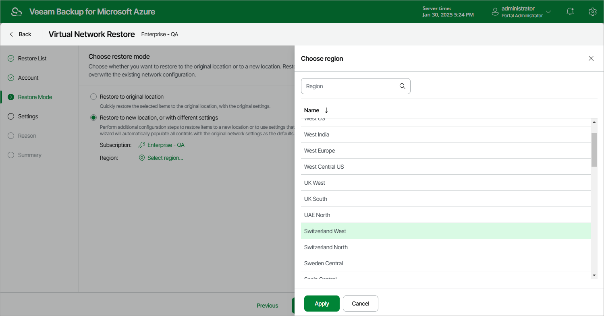

# Step 4. Choose Restore Mode

At the Restore Mode step of the wizard, choose whether you want to restore the selected virtual network configuration to the original or to a custom location. If you select the Restore to new location, or with different settings option, specify the target Azure subscription and Azure region where to restore the virtual network configuration.

|  |
| --- |
| Important |
| Consider the following:   * A resource group that has the same name as the original resource group must exist in the selected location. Otherwise, Veeam Backup for Microsoft Azure will not be able to perform the restore operation. * A virtual network peering can be restored to a new location only in case both peered virtual networks reside in the same region. |

