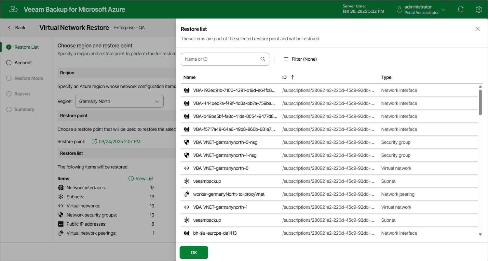

In this article

At the Restore List step of the wizard, select an Azure region and a restore point that will be used to restore the virtual network configuration items. By default, Veeam Backup for Microsoft Azure uses the most recent valid restore point. However, you can restore the virtual network configuration data to an earlier state.

To select a restore point, do the following:

1. In the Region section, select an Azure region whose network configuration items you want to restore.
2. In the Restore point section, click the link to the right of Restore point.
3. In the Available restore points window, select the necessary restore point and click Apply.

For a restore point to be displayed in the list of available restore points, it must be stored in the configuration database. If the restore point that you want to use to recover the virtual network configuration data is stored in a repository, you must first import it to the database as described in section [Importing Virtual Network Configuration Data](importing_vnet_backups.md).

To view the full list of the virtual network configuration items that will be restored, click View List in the Items section.

Page updated 8/20/2025

Page content applies to build 8.0.1.202
