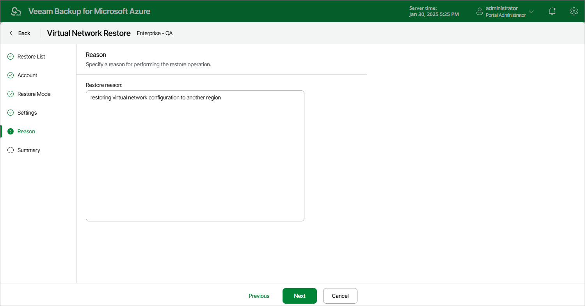

In this article

At the Reason step of the wizard, specify a reason for restoring virtual network configuration. The information you provide will be saved in the session history and you can reference it later.

Page updated 6/12/2024

Page content applies to build 8.0.1.202
