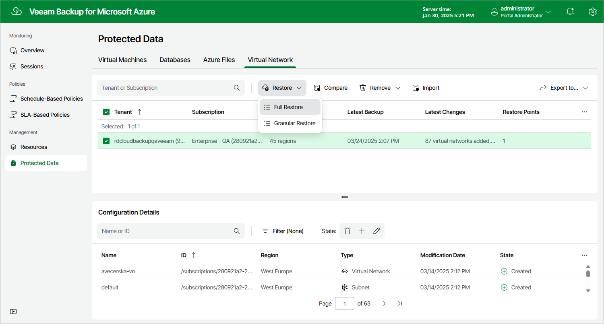

In this article

To launch the Virtual Network Restore wizard, do the following:

1. Navigate to Protected Data > Virtual Network.
2. Select the configuration record for an Azure subscription whose virtual network configuration you want to restore.
3. Click Restore > Full Restore.

Page updated 6/12/2024

Page content applies to build 8.0.1.202
