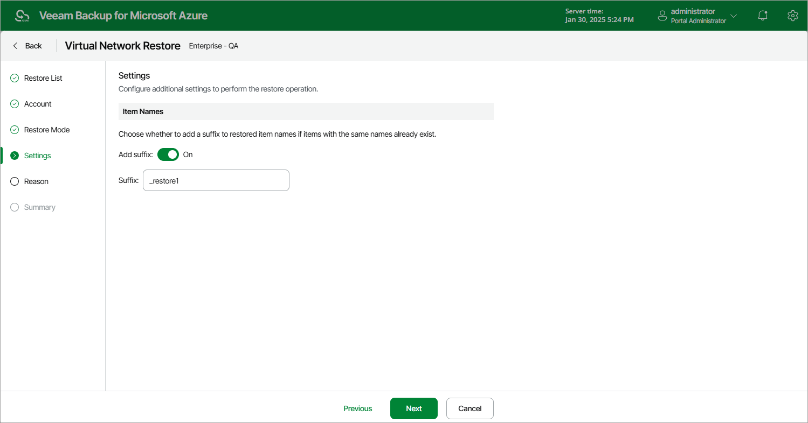

In this article

[This step applies only if you have selected the Restore to new location, or with different settings option at the Restore Mode step of the wizard]

At the Settings step of the wizard, you can choose whether to add a suffix to restored item names if items with the same names already exist. To do that, in the Item Names section, set the Add suffix toggle to On and enter the necessary suffix in the Suffix field.

|  |
| --- |
| Important |
| When restoring the configuration to a new location but the same subscription, make sure the name of each restored item is unique across the entire subscription. Otherwise, Veeam Backup for Microsoft Azure may not be able to perform the restore operation. |

Page updated 6/12/2024

Page content applies to build 8.0.1.202
