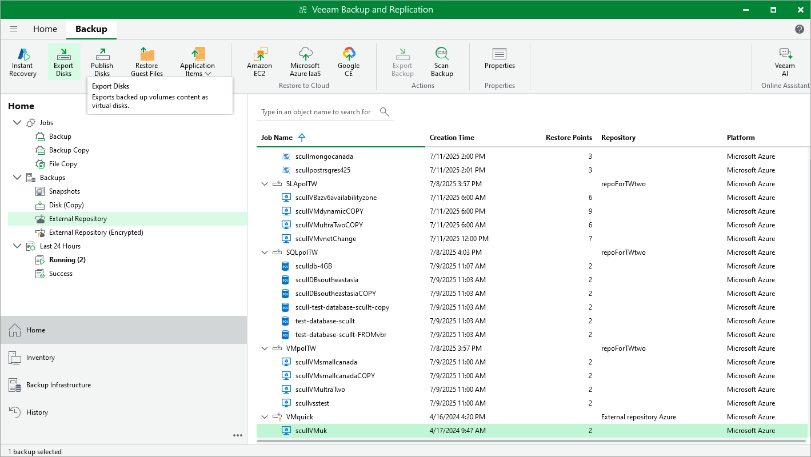

In this article

Veeam Backup & Replication allows you to export disks, that is, to restore virtual disks of Azure VMs from image-level backups created by Veeam Backup for Microsoft Azure and to convert them to the VMDK, VHD and VHDX formats. You can save the converted disks to any server added to the backup infrastructure or place the disks on a datastore connected to an ESXi host (for the VMDK disk format only). For more information, see the Veeam Backup & Replication User Guide, section [Disk Export](https://helpcenter.veeam.com/docs/vbr/userguide/disk_export.html?ver=13).

|  |
| --- |
| Important |
| Disk export cannot be performed using backups that are stored in [Veeam Data Cloud storage vaults](vdc_vaults.md). To perform this operation, use backups that are stored in standard backup repositories for which you have specified Microsoft Azure storage account credentials. To learn how to specify credentials for repositories, see sections [Creating New Repositories](repository_console_storage_account.md) and [Connecting to Existing Appliances](adding_appliance_repository.md). |

To restore disks of an Azure VM to the VMDK, VHD or VHDX format, do the following:

1. In the Veeam Backup & Replication console, open the Home view.
2. Navigate to Backups > External Repository.
3. Expand the backup policy that protects an Azure VM whose disks you want to restore, select the necessary VM and click Export Disk on the ribbon.
4. Complete the Export Disk wizard as described in the Veeam Backup & Replication User Guide, section [Exporting Disks](https://helpcenter.veeam.com/docs/vbr/userguide/disk_export_machine.html?ver=13).

Page updated 12/23/2025

Page content applies to build 8.0.1.202
