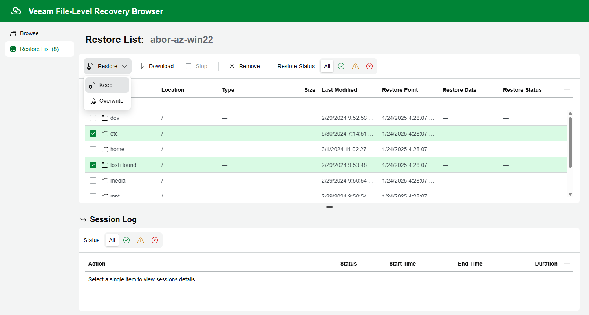

# Step 6. Choose Items to Recover

In the file-level recovery browser, you can find and recover items (files and folders) of the selected Azure VM. All recovered items will be saved in a single .ZIP archive to the default download directory on a local machine from which you access the file-level recovery browser, or will be restored to the original Azure VM.

To recover files and folders from a specific folder, perform the following steps:

1. On the Browse tab, specify files and folders that you want to recover:

1. Navigate to the folder that contains the files and folders.
2. In the working area, select check boxes next to the necessary items and click Add to Restore List.

1. Switch to the Restore List tab, review the list of files and folders, select check boxes next to the items that you want to recover and do the following:

* To download the selected files and folders to the local machine, click Download.
* To restore copies of the selected files and folders to the original Azure VM, click Restore > Keep.

Veeam Backup for Microsoft Azure will save the files with the \_RESTORED\_<date>\_<time> suffix to the same directory where the source files are located. Note that the suffix is added only if the files with the same names already exist on the original VM.

* To restore the selected files and folders to the original Azure VM, click Restore > Overwrite.

Veeam Backup for Microsoft Azure will overwrite the source files.

|  |
| --- |
| Notes |
| * When restoring files that have multiple hard links, Veeam Backup for Microsoft Azure does not modify the state of existing hard links and does not create new ones. Veeam Backup for Microsoft Azure also does not associate any hard links to the files that are restored to a custom location. * When restoring folders that contain any soft links, Veeam Backup for Microsoft Azure recreates these soft links in the restored folder. |

As soon as you click Restore or Download, Veeam Backup for Microsoft Azure will recover the selected files. You can track the progress and view the results of the restore operation in the Session Log section of the Restore List tab.

