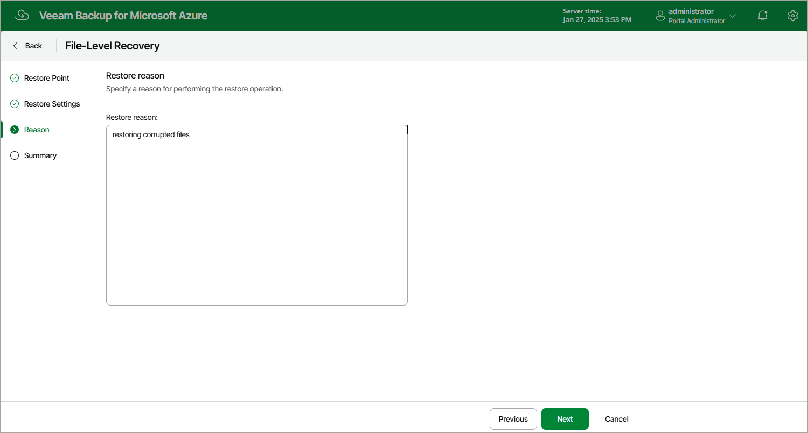

# Step 4. Specify Recovery Reason

At the Reason step of the wizard, specify a reason for recovering files and folders. This information will be saved to the session history, and you will be able to reference it later.

