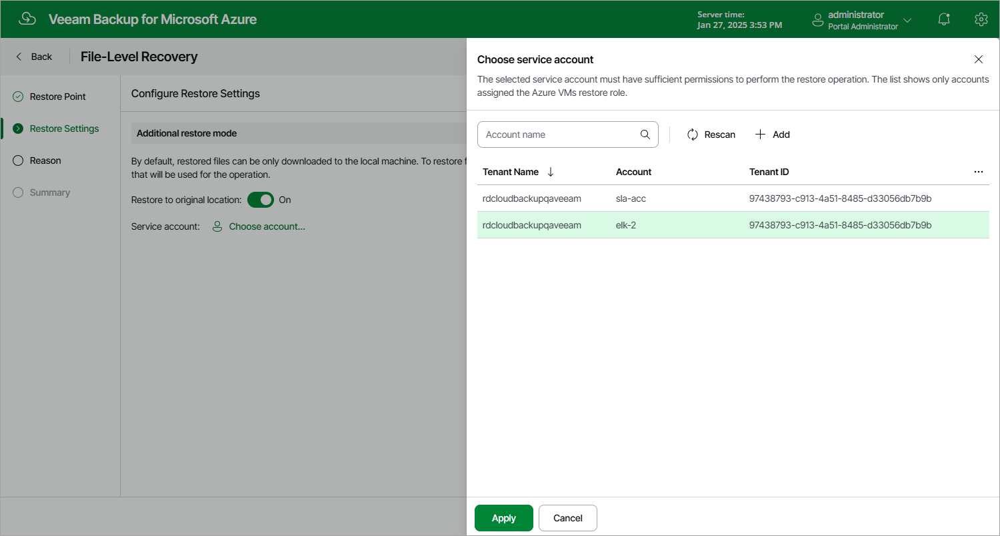

In this article

At the Restore Settings step of the wizard, choose whether you want to restore files to the original location. To do that, set the Restore to original location toggle to On and click the link in the Service account field. Then, select a service account that will be used for the restore operation. The specified service account must be assigned permissions listed in section [Azure VM Permissions](vm_permissions.md#restore).

For a service account to be displayed in the list of available accounts, it must be added to Veeam Backup for Microsoft Azure and assigned the Azure VMs Restore operational role as described in section [Adding Service Accounts](service_account_add.md); also, it must belong to the Microsoft Entra tenant and Azure subscription that contain the Azure VM whose files will be restored. If you have not added the necessary account to Veeam Backup for Microsoft Azure beforehand, you can do it without closing the File-Level Recovery wizard. To do that, click Add and complete the Add Account wizard.

Page updated 4/7/2025

Page content applies to build 8.0.1.202
