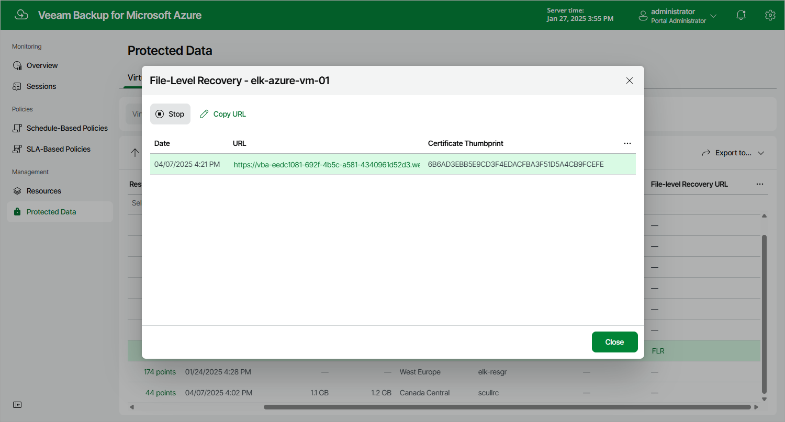

# Step 7. Stop Recovery Session

After you finish working with the file-level recovery browser, it is recommended that you stop the recovery session so that Veeam Backup for Microsoft Azure can unmount and detach virtual disks of the processed Azure VM from the worker instance and deallocate the worker instance.

To stop the recovery session, click Stop in the File-Level Recovery window. If you do not perform any actions in the file-level recovery browser for 30 minutes, and if no files are being restored, Veeam Backup for Microsoft Azure will stop the recovery session automatically.

|  |
| --- |
| Tip |
| If you accidentally close the File-Level Recovery window, navigate to Protected Data and click the link in the File-Level Recovery URL column to open the window again. |

