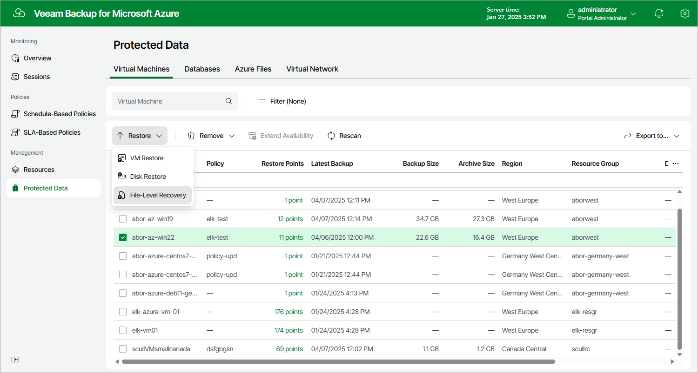

# Step 1. Launch File-Level Recovery Wizard

To launch the File-Level Recovery wizard, do the following:

1. Navigate to Protected Data > Virtual Machines.
2. Select the Azure VM whose files and folders you want to recover.
3. Click Restore > File-Level Recovery.

Alternatively, click the link in the Restore Points column. Then, in the Available Restore Points window, select the necessary restore point and click Restore > File-Level Recovery.

