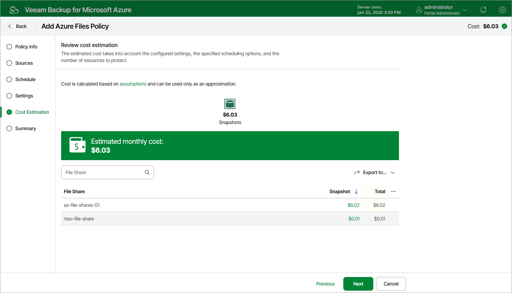

# Step 6. Review Estimated Cost

[This step applies only if you have created a schedule for the backup policy at the Schedule step of the wizard]

At the Cost Estimation step of the wizard, review the approximate monthly cost of Azure services that Veeam Backup for Microsoft Azure will require to protect the Azure file shares added to the backup policy. The total estimated cost includes the following:

* The cost of creating and maintaining snapshots of the Azure file shares.

For each Azure file share included in the backup policy, Veeam Backup for Microsoft Azure takes into account the number of restore points to be kept in the snapshot chain and the configured scheduling settings.

* The cost of making API requests to Microsoft Azure during data protection operations.

|  |
| --- |
| Note |
| To calculate the estimated cost, Veeam Backup for Microsoft Azure uses the capabilities of the [Azure Pricing Calculator](https://azure.microsoft.com/en-us/pricing/calculator/) that estimates the cost of services in USD only. This calculator is intended for informational and estimation purposes only. |

The estimated cost may occur to be significantly higher due to the backup frequency and snapshot charges. To reduce high snapshot charges, adjust the snapshot retention settings to keep less restore points in the snapshot chain.

