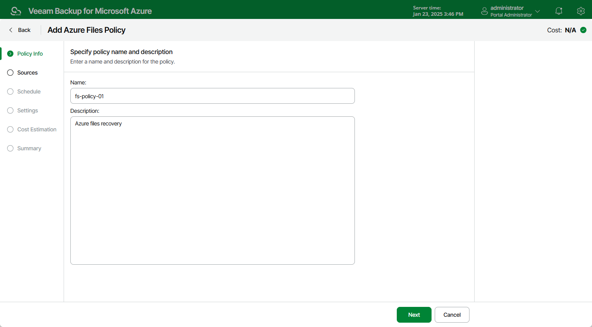

# Step 2. Specify Backup Policy Name

At the Info step of the wizard, use the Name and Description fields to enter a name for the new backup policy and to provide a description for future reference. The maximum length of the name is 255 characters. The following characters are not supported: / \ " ' : | < > + = ; , ? ! \* % # ^ @ & $ .

