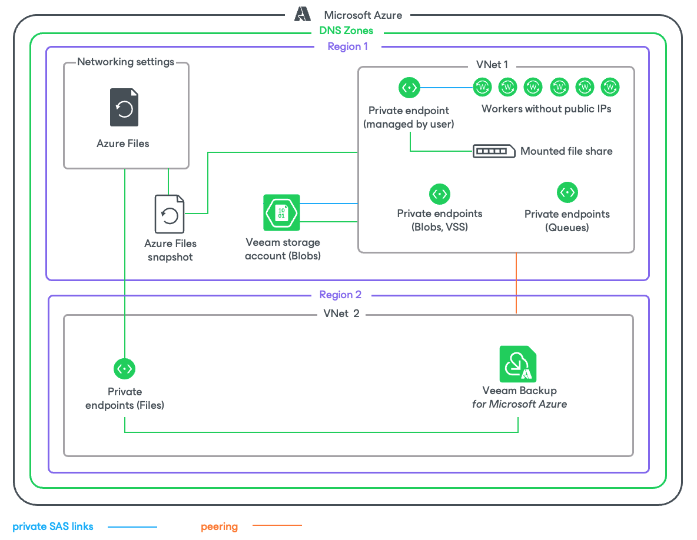

In this article

If the private network deployment functionality is enabled for a backup appliance, Veeam Backup for Microsoft Azure performs Azure Files backup in the following way:

1. Creates a share snapshot of the processed Azure file share using [Microsoft Azure native capabilities](https://docs.microsoft.com/en-us/azure/storage/files/storage-snapshots-files).

|  |
| --- |
| Note |
| Due to Microsoft Azure limitations, the maximum number of snapshots to keep for one file share is 200. |

1. If you enable [file share indexing](fs_backup_source_settings.md#indexing), Veeam Backup for Microsoft Azure performs the following operations:

1. Launches a worker instance in an Azure region in which the processed file share resides.
2. Re-creates the file share from the share snapshot created at step 1 and mounts the share to the worker instance.
3. Reads data from the file share on the worker instance, creates a catalog of files and folders (that is, the index) of the share, and saves the index as a .ZIP file on the backup appliance.

The creation of the .ZIP file may take significant time to complete. If a new backup policy session starts and the previous indexing session is still running, a new indexing session will not be launched.

1. Deallocates the worker instance when the indexing session completes.

Page updated 10/20/2025

Page content applies to build 8.0.1.202
